Lab 2. Basic Feature Extraction Methods
===================================

Learning Objectives
-------------------

By the end of this lab, you will be able to:

-   Categorize data based on content and structure
-   Describe pre-processing steps in detail and implement them to clean
    text data
-   Describe feature engineering
-   Calculate the similarity between texts
-   Visualize text using word clouds and other
    visualization techniques

In this lab, you will learn about basic feature extraction methods
in detail and also visualize text with the help of word clouds and other
visualization techniques.


#### Pre-reqs:
- Google Chrome (Recommended)

#### Lab Environment
Notebooks are ready to run. All packages have been installed. There is no requirement for any setup.

All examples are present in `~/work/nlp-fundamentals/Lesson2` folder. 

You can access lab at `http://<host-ip>/lab/workspaces/lab2_Extraction`


#### Categorizing Data Based on Structure

On the basis of structure, data can be divided into three categories,
namely structured, semi-structured, and unstructured, as shown in the
following diagram:


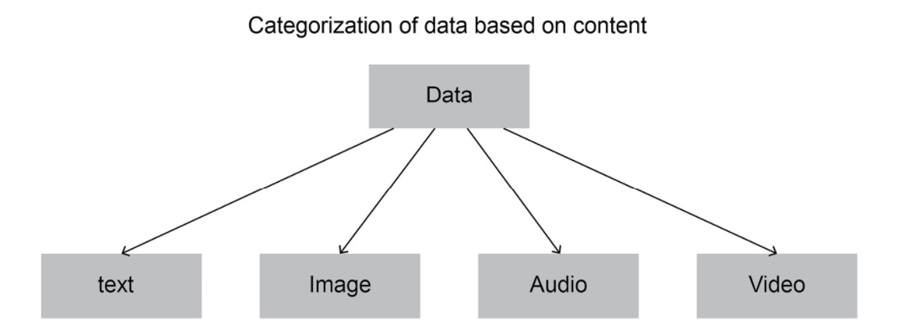
 
 
Three categories are:

- Structured Data:

    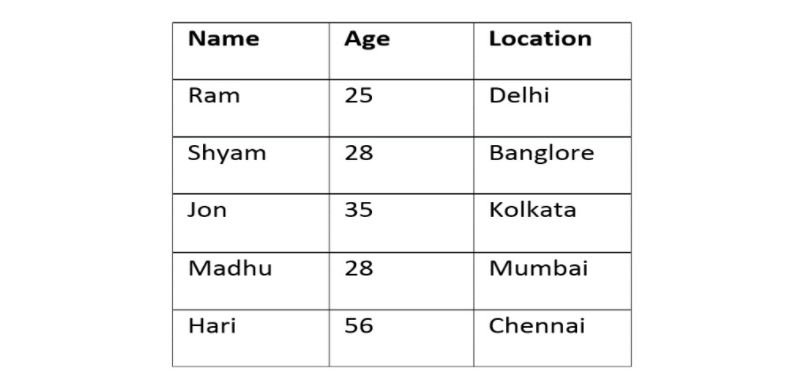

- Semi-Structured Data:

    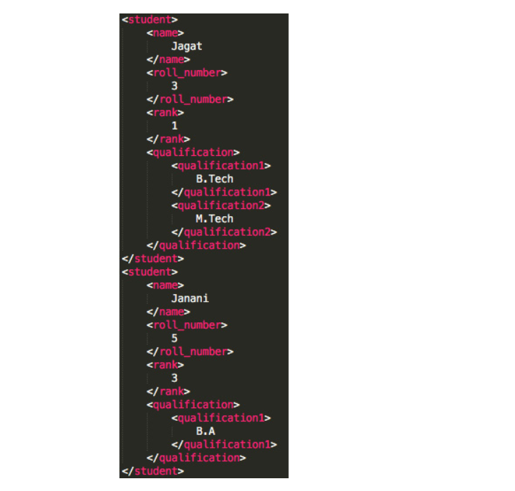

- Unstructured Data

    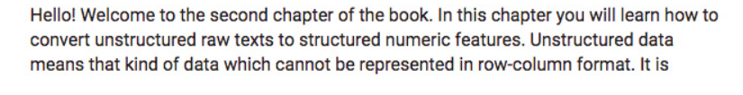


Categorization of Data Based on Content
---------------------------------------

On the basis of content, data can be divided into four categories, as
shown in the following figure:

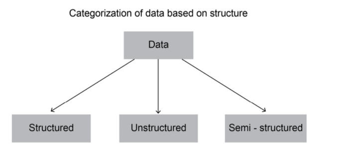


Exercise 12: Text Cleaning and Tokenization
-------------------------------------------

In this exercise, we will clean a text and extract the tokens from it.
Follow these steps to implement this exercise:

1.  Open a Jupyter notebook.

2.  Import the `re` package:


    ```
    import re
    ```


3.  Store the text to be cleaned in a `sentence` variable:


    ```
    sentence = 'Sunil tweeted, "Witnessing 70th Republic Day of India from Rajpath, \
    New Delhi. Mesmerizing performance by Indian Army! Awesome airshow! @india_official \
    @indian_army #India #70thRepublic_Day. For more photos ping me sunil@photoking.com :)"'
    ```


4.  Delete all characters other than digits, alphabetical characters,
    and whitespaces from the text. Use the `split()` function
    to split the strings into parts. Add the following code to implement
    this:

    ```
    re.sub(r'([^\s\w]|_)+', ' ', sentence).split()
    ```


    This command fragments the string wherever any blank space is
    present. The output should be as follows:

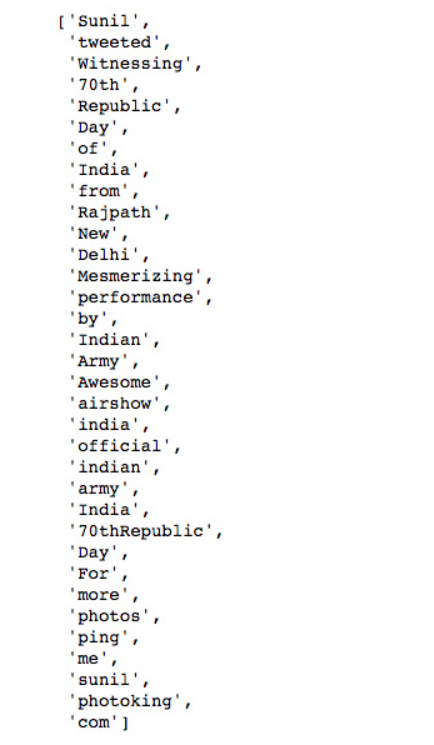


Exercise 13: Extracting n-grams
-------------------------------

In this exercise, we will extract n-grams using three different methods;
namely, via custom-defined functions, via `nltk`, and via
`TextBlob`. Follow these steps to implement this exercise:

1.  Open a Jupyter notebook.

2.  Import the `re` package and define a custom-defined
    function, which we can use to extract n-grams. Add the following
    code to do this:


    ```
    import re
    def n_gram_extractor(sentence, n):
        tokens = re.sub(r'([^\s\w]|_)+', ' ', sentence).split()
        for i in range(len(tokens)-n+1):
            print(tokens[i:i+n])
    ```


3.  To check the bi-grams, we pass the function with text and n. Add the
    following code to do this:

    ```
    n_gram_extractor('The cute little boy is playing with the kitten.', 2)
    ```


    The code generates the following output:

    
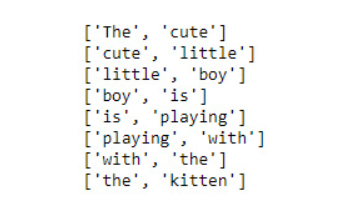

4.  To check the tri-grams, we pass the function with the text and n.
    Add the following code to do this:

    ```
    n_gram_extractor('The cute little boy is playing with the kitten.', 3)
    ```


    The code generates the following output:

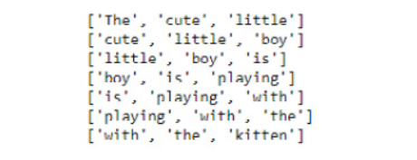


5.  To check the bi-grams using the `nltk` library, add the
    following code:

    ```
    from nltk import ngrams
    list(ngrams('The cute little boy is playing with the kitten.'.split(), 2))
    ```


    The code generates the following output:

    
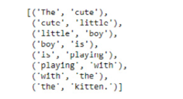

6.  To check the tri-grams using the `nltk` library, add the
    following code:

    ```
    list(ngrams('The cute little boy is playing with the kitten.'.split(), 2))
    ```


  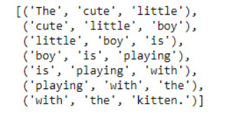


7.  To check the bi-grams using the `TextBlob` library, add
    the following code:

    ```
    from textblob import TextBlob
    blob = TextBlob("The cute little boy is playing with the kitten.")
    blob.ngrams(n=2)
    ```


    The code generates the following output:

 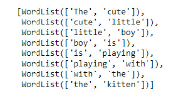


8.  To check the tri-grams using the TextBlob library, add the following
    code:

    ```
    blob.ngrams(n=3)
    ```


    The code generates the following output:

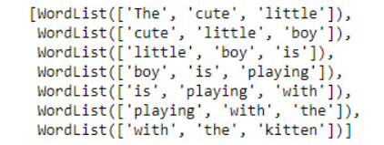

**Keras** and **TextBlob** are two of the most popular Python libraries
used for performing various NLP tasks. TextBlob provides a simple and
easy-to-use interface to do so. Keras is used mainly for performing deep
learning-based NLP tasks.


Exercise 14: Tokenizing Texts with Different Packages -- Keras and TextBlob
---------------------------------------------------------------------------

In this exercise, we will make use of Keras and TextBlob to tokenize
texts. Follow these steps to implement this exercise:

1.  Open a Jupyter notebook, insert a new cell, and declare a variable
    `sentence`:


    ```
    sentence = 'Sunil tweeted, "Witnessing 70th Republic Day of India from Rajpath, \
    New Delhi. Mesmerizing performance by Indian Army! Awesome airshow! @india_official \
    @indian_army #India #70thRepublic_Day. For more photos ping me sunil@photoking.com :)"'
    ```


2.  Import the `keras` and `textblob` libraries:


    ```
    from keras.preprocessing.text import text_to_word_sequence
    from textblob import TextBlob
    ```


3.  To tokenize using the `keras` library, add the following
    code:

    ```
    text_to_word_sequence(sentence)
    ```


    The code generates the following output:

    
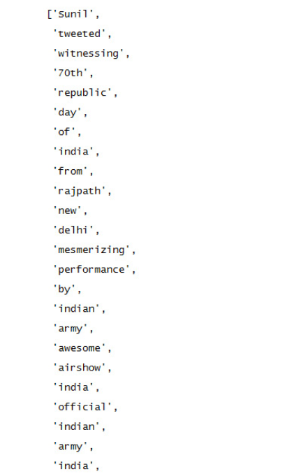

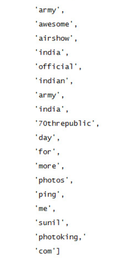

4.  To tokenize using the `TextBlob` library, add the
    following code:

    ```
    blob = TextBlob(sentence)
    blob.words
    ```


    The code generates the following output:

    
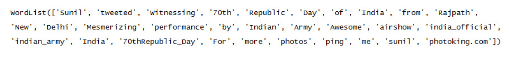


Exercise 15: Tokenizing Text Using Various Tokenizers
-----------------------------------------------------

In this exercise, we will use make use of different tokenizers to
tokenize text. Follow these steps to implement this exercise:

1.  Open a Jupyter notebook.

2.  Insert a new cell and the following code to declare a variable
    sentence:


    ```
    sentence = 'Sunil tweeted, "Witnessing 70th Republic Day of India from Rajpath, \
    New Delhi. Mesmerizing performance by Indian Army! Awesome airshow! @india_official \
    @indian_army #India #70thRepublic_Day. For more photos ping me sunil@photoking.com :)"'
    ```


3.  To tokenize the text using `TweetTokenizer`, add the
    following code:

    ```
    from nltk.tokenize import TweetTokenizer
    tweet_tokenizer = TweetTokenizer()
    tweet_tokenizer.tokenize(sentence)
    ```


    The code generates the following output:

    
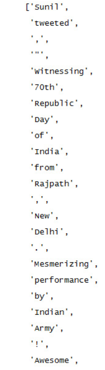

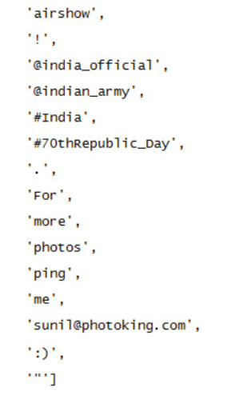


4.  To tokenize the text using the MWE tokenizer, add the following
    code:

    ```
    from nltk.tokenize import MWETokenizer
    mwe_tokenizer = MWETokenizer([('Republic', 'Day')])
    mwe_tokenizer.add_mwe(('Indian', 'Army'))
    mwe_tokenizer.tokenize(sentence.split())
    ```


    The code generates the following output:

    
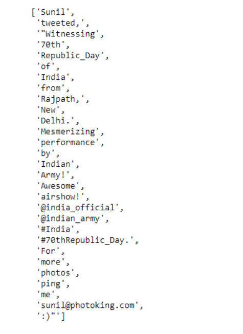

5.  In the preceding figure, the words \"Indian\" and \"Army!\" were
    supposed to be treated as a single identity, but they got separated.
    This is because \"Army!\" (not \"Army\") is treated as a token.
    Let\'s see how this can be fixed in the next step.

6.  Add the following code to fix the issues in the previous step:

    ```
    mwe_tokenizer.tokenize(sentence.replace('!','').split())
    ```


    The code generates the following output:

    
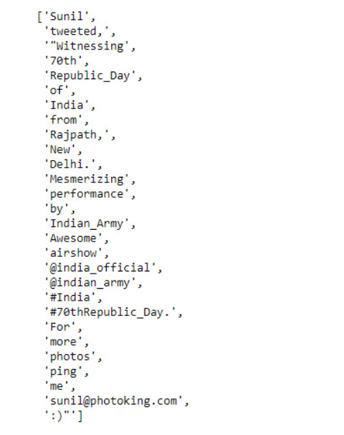

7.  To tokenize the text using the regular expression tokenizer, add the
    following code:

    ```
    from nltk.tokenize import RegexpTokenizer
    reg_tokenizer = RegexpTokenizer('\w+|\$[\d\.]+|\S+')
    reg_tokenizer.tokenize(sentence)
    ```


    The code generates the following output:

    
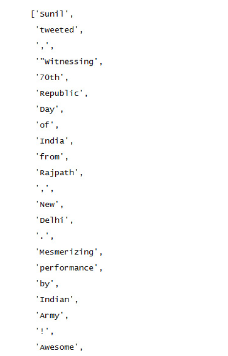

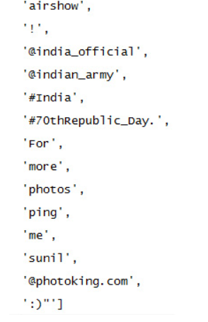


8.  To tokenize the text using the whitespace tokenizer, add the
    following code:

    ```
    from nltk.tokenize import WhitespaceTokenizer
    wh_tokenizer = WhitespaceTokenizer()
    wh_tokenizer.tokenize(sentence)
    ```


    The code generates the following output:

    
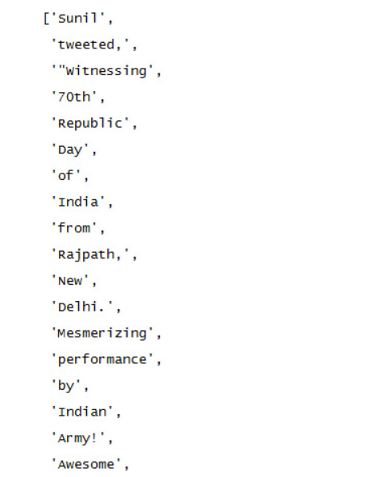

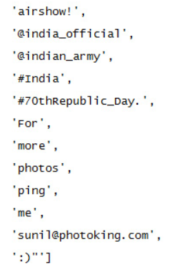

9.  To tokenize the text using the Word Punkt tokenizer, add the
    following code:

    ```
    from nltk.tokenize import WordPunctTokenizer
    wp_tokenizer = WordPunctTokenizer()
    wp_tokenizer.tokenize(sentence)
    ```


    The code generates the following output:

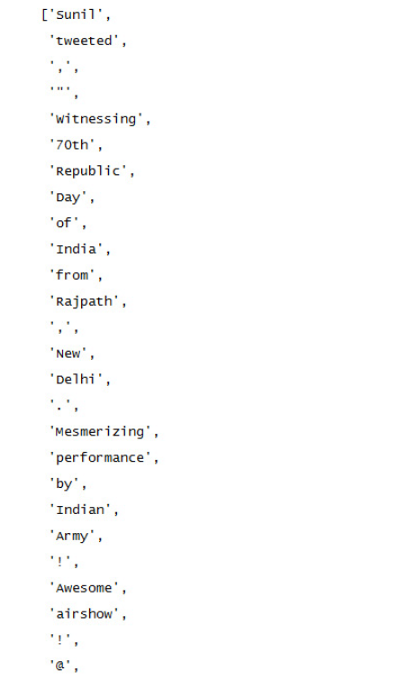

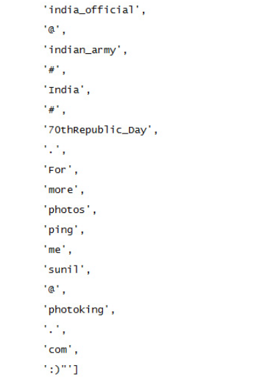


We have learned how to tokenize text using different tokenizers.


RegexpStemmer
-------------

RegexpStemmer uses regular expressions to check whether morphological or
structural prefixes or suffixes are present. For instance, in many
cases, the gerund form of a verb (so, the form ending with \"ing\") can
be restored back to the base form simply by removing \"ing\" from the
end; for example, \"playing\" -\> \"play\".

Let\'s do the following exercise to get some hands-on experience of
using RegexpStemmer.

Exercise 16: Converting words in gerund form into base words using RegexpStemmer
--------------------------------------------------------------------------------

In this exercise, we will use RegexpStemmer on text to transform words
ending with \"ing\" into their base form. Follow these steps to
implement this exercise:

1.  Open a Jupyter notebook.

2.  Insert a new cell and add the following code to declare a
    `sentence` variable:


    ```
    sentence = "I love playing football"
    ```


3.  Now we\'ll make use of `regex_stemmer` to stem each word
    of the `sentence` variable. Add the following code to do
    this:

    ```
    from nltk.stem import RegexpStemmer
    regex_stemmer = RegexpStemmer('ing$', min=4) 
    ' '.join([regex_stemmer.stem(wd) for wd in sentence.split()])
    ```


    The code generates the following output:

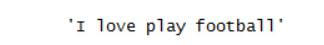


In the next section, we will discuss the Porter stemmer.

#### The Porter Stemmer

The Porter stemmer is the most common stemmer for dealing with English
words. It removes various morphological and inflectional endings (such
as suffixes and prefixes) from English words.

Exercise 17: The Porter Stemmer
-------------------------------

In this exercise, we will apply the Porter stemmer to some text. Follow
these steps to implement this exercise:

1.  Open a Jupyter notebook.

2.  Import `nltk` and related packages, and declare a
    `sentence` variable. Add the following code to do this:


    ```
    sentence = "Before eating, it would be nice to sanitize your hands with a sanitizer"
    from nltk.stem.porter import *
    ```

3.  Now we\'ll make use of the Porter stemmer to stem each word of the
    `sentence` variable:

    ```
    ps_stemmer = PorterStemmer()
    ' '.join([ps_stemmer.stem(wd) for wd in sentence.split()])
    ```


    The code generates the following output:

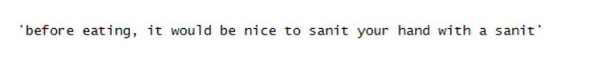

In the next section, we will learn about another pre-processing step: lemmatization.


Exercise 18: Lemmatization
--------------------------

In this exercise, we will make use of lemmatization to lemmatize a given
text. Follow these steps to implement this exercise:

1.  Open a Jupyter notebook.

2.  Import `nltk` and related packages, then declare a
    `sentence` variable. Add the following code to implement
    this:


    ```
    import nltk
    from nltk.stem import WordNetLemmatizer
    from nltk import word_tokenize
    nltk.download('wordnet')
    lemmatizer = WordNetLemmatizer()
    sentence = "The products produced by the process today are far better than what it produces generally."
    ```


3.  To lemmatize the tokens extracted from the sentence, add the
    following code:

    ```
    ' '.join([lemmatizer.lemmatize(word) for word in word_tokenize(sentence)])
    ```


    The code generates the following output:

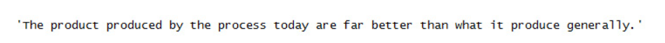

In the next section, we will deal with other kinds of word variations,
looking at singularizing and pluralizing words. TextBlob provides a nice
function to singularize and pluralize words. Let\'s see how this is done
in the next section.

Exercise 19: Singularizing and Pluralizing Words
------------------------------------------------

In this exercise, we will make use of the TextBlob library to
singularize and pluralize the words in a given text. Follow these steps
to implement this exercise:

1.  Open a Jupyter notebook.

2.  Import TextBlob and declare a sentence variable. Add the following
    code to implement this:

    ```
    from textblob import TextBlob
    sentence = TextBlob('She sells seashells on the seashore')
    ```


    To check the list of words in sentence, type the following code:

    ```
    sentence.words
    ```


    The code generates the following output:

    
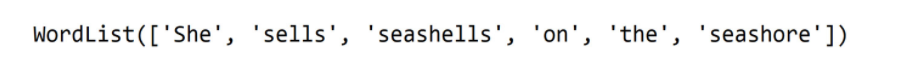

3.  To singluarize the second word in the given sentence, type the
    following code:

    ```
    sentence.words[2].singularize()
    ```


    The code generates the following output:

    
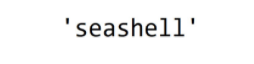


4.  To pluralize the fifth word in the given sentence, type the
    following code:

    ```
    sentence.words[5].pluralize()
    ```


    The code generates the following output:

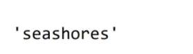

In the next section, we will learn about another pre-processing task:
language translation.

Language Translation
--------------------

Different languages are often used together to convey something. In such
cases, translating the entire text into a single language becomes an
essential pre-processing task for analyzing it. Let\'s look at an
exercise in the next section.

Exercise 20: Language Translation
---------------------------------

In this exercise, we will make use of the TextBlob library to translate
a sentence from Spanish to English. Follow these steps to implement this
exercise:

1.  Open a Jupyter notebook.

2.  Import the TextBlob library:


    ```
    from textblob import TextBlob
    ```


3.  Make use of the `translate` function of TextBlob to
    translate the input text from Spanish to English. Add the following
    code to do this:

    ```
    en_blob = TextBlob(u'muy bien')
    en_blob.translate(from_lang='es', to='en')
    ```


    The code generates the following output:

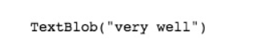


Stop-Word Removal
-----------------

Stop words, such as \"am,\" \"the,\" and \"are,\" support words and
sentences. They help us to construct sentences. But they do not affect
the meaning of the sentence in which they are present. Thus, we can
safely ignore their presence. To get a better understanding of this,
let\'s look at an exercise in the next section.

Exercise 21: Stop-Word Removal
------------------------------

In this exercise, we will remove the stop words from a given text.
Follow these steps to implement this exercise:

1.  Open a Jupyter notebook.

2.  Import `nltk` and declare a `sentence` variable
    with the text in question:


    ```
    from nltk import word_tokenize
    sentence = "She sells seashells on the seashore"
    ```


3.  Define a custom list of stop words and execute the following lines
    of code:

    ```
    custom_stop_word_list = ['she', 'on', 'the', 'am', 'is', 'not']
    ' '.join([word for word in word_tokenize(sentence) if word.lower() not in custom_stop_word_list])
    ```


    The code generates the following output:

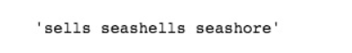

We have learned how to remove the stop words from a given sentence. In
the next section, we will explore the concept of extracting features
from texts.


Exercise 22: Extracting General Features from Raw Text
------------------------------------------------------

In this exercise, we will extract general features from input text.
These general features include detecting the number of words, the
presence of "wh-" words (words beginning with "wh"), the polarity, the
subjectivity, and the language in which the text is written. Follow
these steps to implement this exercise:

1.  Open a Jupyter notebook.
2.  Import the `pandas` library and create a
    `DataFrame` with four sentences. Add the following code to
    implement this:


    ```
    import pandas as pd
    df = pd.DataFrame([['The interim budget for 2019 will be announced on 1st February.'], ['Do you know how much expectation the middle-class working population is having from this budget?'], ['February is the shortest month in a year.'], ['This financial year will end on 31st March.']])
    df.columns = ['text']
    df
    ```

    The code generates the following output:


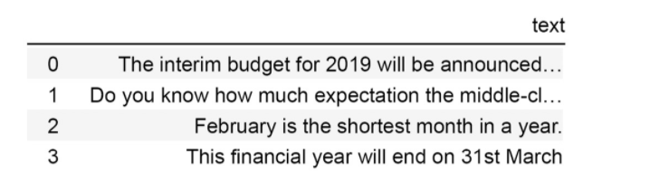

3.  Use the `apply` function to iterate through each row of
    the column text, convert them to TextBlob objects, and extract words
    from them. Add the following code to implement this:


    ```
    from textblob import TextBlob
    df['number_of_words'] = df['text'].apply(lambda x : len(TextBlob(str(x)).words))
    df['number_of_words']
    ```

    The code generates the following output:

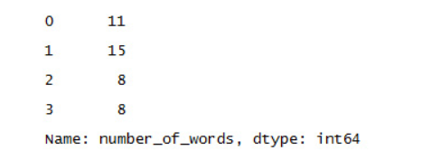


4.  Now, again, we make use of the `apply` function to iterate
    through each row of the column text, convert them to TextBlob
    objects, and extract the words from them to check whether any of the
    words belong to the list of *wh* words that has been declared:


    ```
    wh_words = set(['why', 'who', 'which', 'what', 'where', 'when', 'how'])
    df['is_wh_words_present'] = df['text'].apply(lambda x : True if \
                                                 len(set(TextBlob(str(x)).words).intersection(wh_words))>0 else False)
    df['is_wh_words_present']
    ```

    The code generates the following output:

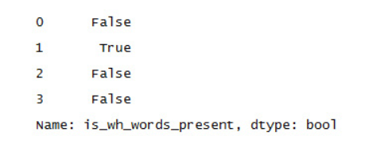

5.  Use the `apply` function to iterate through each row of
    the column text, convert them to TextBlob objects, and extract their
    sentiment scores:


    ```
    df['polarity'] = df['text'].apply(lambda x : TextBlob(str(x)).sentiment.polarity)
    df['polarity']
    ```

    The code generates the following output:

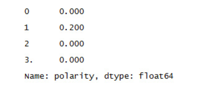

6.  Use the `apply` function to iterate through each row of
    the column text, convert them to TextBlob objects, and extract their
    subjectivity scores:


    ```
    df['subjectivity'] = df['text'].apply(lambda x : TextBlob(str(x)).sentiment.subjectivity)
    df['subjectivity']
    ```

    The code generates the following output:

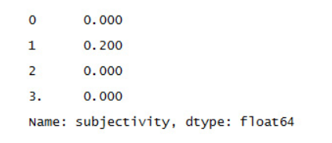

    ##### Note

    Sentiment scores such as subjectivity and polarity will be explained
    in detail in *Lab 8, Sentiment Analysis*.

7.  Use the apply function to iterate through each row of the column
    text, convert them to TextBlob objects, and detect their languages:


    ```
    df['language'] = df['text'].apply(lambda x : TextBlob(str(x)).detect_language())
    df['language']
    ```

    The code generates the following output:

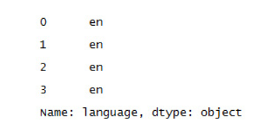

We have learned how to extract general features from a given text. In
the next section, we will solve an activity to get a better
understanding of this.

Activity 2: Extracting General Features from Text
-------------------------------------------------

In this activity, we will extract various general features from
documents. The dataset that we are using consists of random statements.
Our objective is to find various general features such as punctuation,
uppercase and lowercase words, letter characters, digits, words, and
whitespaces.

### Note

The `data.csv` dataset used in this activity can be found at this location:

`/home/jovyan/work/nlp-fundamentals/Lesson2/data_ch2`

Follow these steps to implement this activity:

1.  Open a Jupyter notebook.
2.  Import `pandas`, `nltk`, and the other necessary
    libraries.
3.  Load `data.csv` using pandas' `read_csv`
    function.
4.  Find the number of occurrences of each part of speech (PoS). You can
    see the PoS that nltk provides by loading it from
    `help/tagsets/upenn_tagset.pickle`.
5.  Find the amount of punctuation marks.
6.  Find the amount of uppercase and lowercase words.
7.  Find the number of letters.
8.  Find the number of digits.
9.  Find the amount of words.
10. Find the amount of whitespaces for each sentence.

    Note: The solution for this activity can be found in the current directory.

We have learned how to extract general features from a given text. In
the next section, we will explore special features that can be extracted
from a given text.

Bag of Words
------------

The Bag-of-Words (BoW) model is one of the most popular methods for
extracting features from raw texts. The output of this model for a set
of text documents is a matrix. Each column of the matrix represents a
word from the vocabulary and each row corresponds to one of these text
documents. Here, "vocabulary" refers to a unique set of words present in
a document. Let's understand this with an example. Suppose you have two
text documents:

*Document 1: I like detective Byomkesh Bakshi.*

*Document 2: Byomkesh Bakshi is not a detective, he is a truth seeker.*


The representation of the BoW model would be as follows:


Let's see how BoW can be implemented using Python.

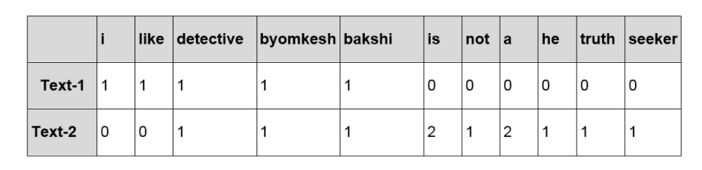


Exercise 23: Creating a BoW
---------------------------

In this exercise, we will create a BoW representation for all the terms
in a document and ascertain the 10 most frequent terms. Follow these
steps to implement this exercise:

1.  Open a Jupyter notebook.
2.  Import the necessary libraries and declare a list corpus. Add the
    following code to implement this:


    ```
    import pandas as pd
    from sklearn.feature_extraction.text import CountVectorizer
    corpus = [
    'Data Science is an overlap between Arts and Science',
    'Generally, Arts graduates are right-brained and Science graduates are left-brained',
    'Excelling in both Arts and Science at a time becomes difficult',
    'Natural Language Processing is a part of Data Science']
    ```

3.  Now we'll make use of the `CountVectorizer` function to
    create the BoW model. Add the following code to do this:


    ```
    bag_of_words_model = CountVectorizer()
    print(bag_of_words_model.fit_transform(corpus).todense())
    bag_of_word_df = pd.DataFrame(bag_of_words_model.fit_transform(corpus).todense())
    bag_of_word_df.columns = sorted(bag_of_words_model.vocabulary_)
    bag_of_word_df.head()
    ```

    The code generates the following output:

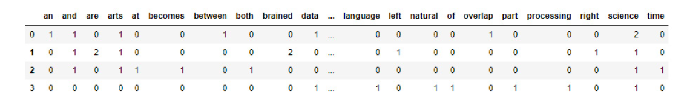

4.  Now we create a BoW model for the 10 most frequent terms. Add the
    following code to implement this:


    ```
    bag_of_words_model_small = CountVectorizer(max_features=10)
    bag_of_word_df_small = pd.DataFrame(bag_of_words_model_small.fit_transform(corpus).todense())
    bag_of_word_df_small.columns = sorted(bag_of_words_model_small.vocabulary_)
    bag_of_word_df_small.head()
    ```

    The code generates the following output:

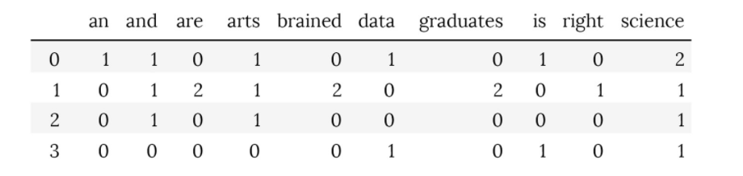

Zipf's Law
----------

According to Zipf's law, "for a given corpus of natural language
utterances, the frequency of any word is inversely proportional to its
rank in the frequency table." In simple terms, if the words in a corpus
are arranged in descending order of their frequency of occurrence, then
the frequency of the word at ith rank will be proportional to 1/i. To
get a better understanding of this, let's look at an exercise in the
next section.

Exercise 24: Zipf's Law
-----------------------

In this exercise, we will plot the actual ranks and frequencies of
tokens, along with the expected ranks and frequencies, with the help of
Zipf's law. We will be using the 20newsgroups dataset provided by the
`sklearn` library, which is a collection of newsgroup
documents. Follow these steps to implement this exercise:

1.  Open a Jupyter notebook.
2.  Import the necessary libraries, declare a
    `newsgroups_data_sample` variable, and fetch the dataset
    provided by `sklearn`, that is,
    `fetch_20newsgroups`. Add the following code to do this:


    ```
    from pylab import *
    import nltk
    nltk.download('stopwords')
    from sklearn.datasets import fetch_20newsgroups
    from nltk import word_tokenize
    from nltk.corpus import stopwords
    import matplotlib.pyplot as plt
    %matplotlib inline
    import re
    import string
    from collections import Counter
    newsgroups_data_sample = fetch_20newsgroups(subset='train')
    ```

3.  Now we'll add individual printable characters to get a list of stop
    words. Add the following code to implement this:


    ```
    stop_words = stopwords.words('english')
    stop_words = stop_words + list(string.printable)
    ```

4.  To tokenize the corpus, add the following code:


    ```
    tokenized_corpus = [word.lower() for sentence in newsgroups_data_sample['data'] \
                        for word in word_tokenize(re.sub(r'([^\s\w]|_)+', ' ', sentence)) \
                        if word.lower() not in stop_words]
    ```

5.  Add the following code to calculate the frequency of each token:


    ```
    token_count_di = Counter(tokenized_corpus)
    token_count_di.most_common(50)
    ```

    The code generates the following output:

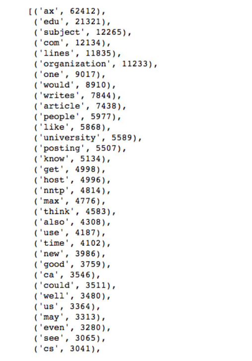

6.  Now, to plot the actual ranks and frequencies of the tokens along
    with the expected ranks and frequencies as per Zipf's law, we add
    the following code:


    ```
    frequencies = [b for (a,b) in token_count_di.most_common(10000)]
    tokens = [a for (a,b) in token_count_di.most_common(10000)]
    ranks = range(1, len(frequencies)+1)
    plt.figure(figsize=(8,8))
    plt.ylim(1,10**4)
    plt.xlim(1,10**4)
    #Actual ranks and frequencies
    obtained_line, = loglog(ranks, frequencies, marker=".", label="Line obtained from the Text Corpus")
    obtained_legend = plt.legend(handles=[obtained_line], loc=1)
    ax = plt.gca().add_artist(obtained_legend)
    #Expected ranks and frequencies as per Zipf's law
    expected_line, = plt.plot([1,frequencies[0]],[frequencies[0],1],color='r',label="Line expected as per Zipf's Law")
    plt.legend(handles=[expected_line], loc=4)
    title("Plot stating Zipf law's in log-log scale")
    xlabel("Rank of token in descending order of frequency of occurrence")
    ylabel("Frequency of ocurrence of token")
    grid(True)
    ```

    The code generates the following output:

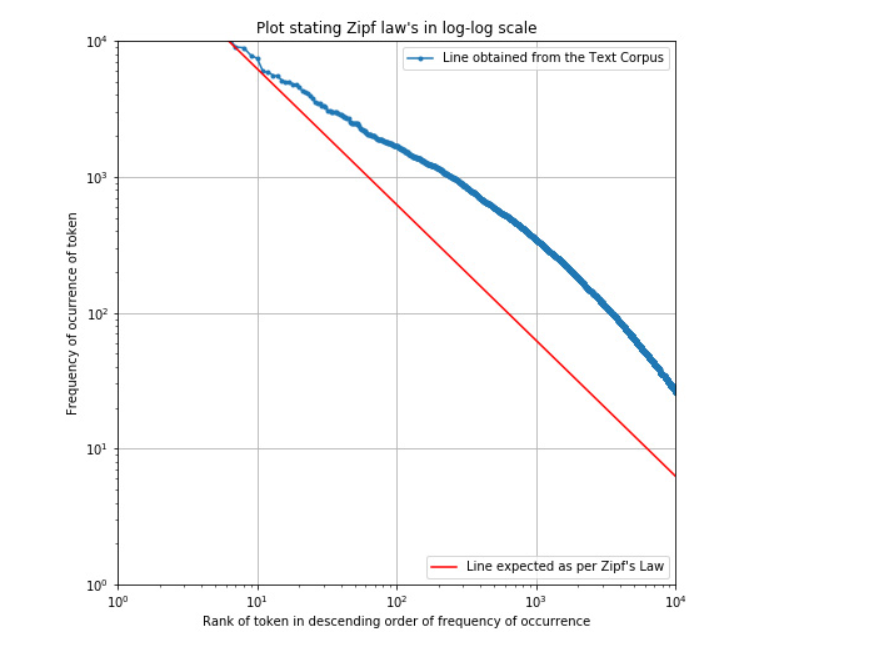


TF-IDF
------

The IDF for a given term is given by the following formula:

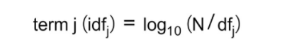

Here, dfj refers to the number of documents with term j. N is the total
number of documents. Thus, the TF-IDF score for term j in document i
will be as follows:

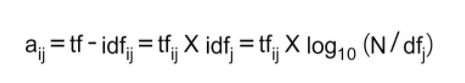

Let's do an exercise in the next section and learn how TF-IDF can be
implemented in Python.


Exercise 25: TF-IDF Representation
----------------------------------

In this exercise, we will create a TF-IDF representation of the input
texts for all the terms in a given corpus and identify the 10 most
frequent terms. Follow these steps to implement this exercise:

1.  Open a Jupyter notebook.
2.  Import all the necessary libraries and create a DataFrame consisting
    of the sentences. Add the following code to implement this:


    ```
    import pandas as pd
    from sklearn.feature_extraction.text import TfidfVectorizer
    corpus = [
    'Data Science is an overlap between Arts and Science',
    'Generally, Arts graduates are right-brained and Science graduates are left-brained',
    'Excelling in both Arts and Science at a time becomes difficult',
    'Natural Language Processing is a part of Data Science']
    ```

3.  Now, to create a TF-IDF model, we write the following code:


    ```
    tfidf_model = TfidfVectorizer()
    print(tfidf_model.fit_transform(corpus).todense())
    ```

    The code generates the following output:

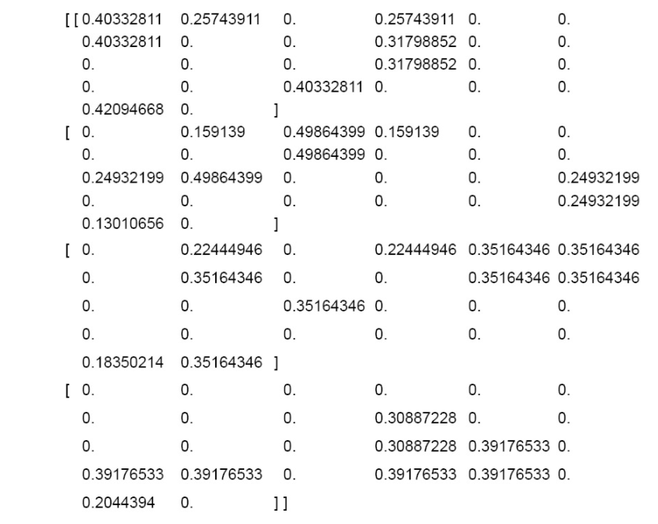

4.  Now, to create a DataFrame from the generated `tf-idf`
    matrix, we write the following code:


    ```
    tfidf_df = pd.DataFrame(tfidf_model.fit_transform(corpus).todense())
    tfidf_df.columns = sorted(tfidf_model.vocabulary_)
    tfidf_df.head()
    ```

    The code generates the following output:

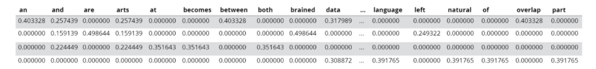

5.  Now we'll create a DataFrame from the `tf-idf` matrix for
    the 10 most frequent terms. Add the following code to implement
    this:


    ```
    tfidf_model_small = TfidfVectorizer(max_features=10)
    tfidf_df_small = pd.DataFrame(tfidf_model_small.fit_transform(corpus).todense())
    tfidf_df_small.columns = sorted(tfidf_model_small.vocabulary_)
    tfidf_df_small.head()
    ```

    The code generates the following output:

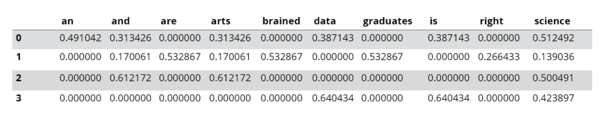

In the next section, we will solve an activity to extract specific
features from texts.

Activity 3: Extracting Specific Features from Texts
---------------------------------------------------

In this activity, we will extract specific features from the texts
present in a dataset. The dataset that we will be using here is
`fetch_20newsgroups`, provided by the sklearn library. Follow
these steps to implement this activity:

1.  Import the necessary packages.
2.  Fetch the dataset provided by sklearn,
    `fetch_20newsgroup`, and store the data in a DataFrame.
3.  Clean the data in the DataFrame.
4.  Create a BoW model.
5.  Create a TF-IDF model.
6.  Compare both models on the basis of the 20 most frequently occurring
    words.

    ##### Note

    The solution for this activity can be found in the current directory.

We have learned how to compare the BoW and TF-IDF models. In the next
section, we will learn more about feature engineering.


Feature Engineering
===================


Feature engineering is a method for extracting new features from
existing features. There are various ways of calculating the similarity between two
texts. The most popular methods are cosine similarity and Jaccard
similarity. Let\'s learn about each of them:

- Cosine similarity
- Jaccard similarity


Exercise 26: Feature Engineering (Text Similarity)
--------------------------------------------------

In this exercise, we will calculate the Jaccard and cosine similarity
for a given pair of texts. Follow these steps to implement this
exercise:

1.  Open a Jupyter notebook.

2.  Insert a new cell and add the following code to import the necessary
    packages:


    ```
    from nltk import word_tokenize
    from nltk.stem import WordNetLemmatizer
    from sklearn.feature_extraction.text import TfidfVectorizer
    from sklearn.metrics.pairwise import cosine_similarity
    lemmatizer = WordNetLemmatizer()
    ```


3.  Now we declare the `pair1`, `pair2`, and
    `pair3` variables, as follows:


    ```
    pair1 = ["What you do defines you","Your deeds define you"]
    pair2 = ["Once upon a time there lived a king.", "Who is your queen?"]
    pair3 = ["He is desperate", "Is he not desperate?"]
    ```


4.  We will create a function to extract the Jaccard similarity between
    a pair of sentences. Add the following code to do this:


    ```
    def extract_text_similarity_jaccard (text1, text2):
        words_text1 = [lemmatizer.lemmatize(word.lower()) for word in word_tokenize(text1)]
        words_text2 = [lemmatizer.lemmatize(word.lower()) for word in word_tokenize(text2)]
        nr = len(set(words_text1).intersection(set(words_text2)))
        dr = len(set(words_text1).union(set(words_text2)))
        jaccard_sim = nr/dr
        return jaccard_sim
    ```


5.  To check the Jaccard similarity between statements in
    `pair1`, write the following code:

    ```
    extract_text_similarity_jaccard(pair1[0],pair1[1])
    ```


    The code generates the following output:

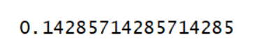


6.  To check the Jaccard similarity between statements in
    `pair2`, write the following code:

    ```
    extract_text_similarity_jaccard(pair2[0],pair2[1])
    ```


    The code generates the following output:

    


7.  To check the Jaccard similarity between statements in
    `pair3`, write the following code:

    ```
    extract_text_similarity_jaccard(pair3[0],pair3[1])
    ```


    The code generates the following output:

    


8.  To check the cosine similarity, we first create a corpus that will
    have texts of `pair1`, `pair2`, and
    `pair3`. Add the following code to do this:


    ```
    tfidf_model = TfidfVectorizer()
    corpus = [pair1[0], pair1[1], pair2[0], pair2[1], pair3[0], pair3[1]]
    ```


9.  Now we store the `tf-idf` representations of the texts of
    pair1, pair2, and pair3 in a `tfidf_results` variable. Add
    the following code to do this:


    ```
    tfidf_results = tfidf_model.fit_transform(corpus).todense()
    ```


10. To check the cosine similarity between the initial two texts, we
    write the following code:

    ```
    cosine_similarity(tfidf_results[0],tfidf_results[1])
    ```


    The code generates the following output:


11. To check the cosine similarity between the third and fourth texts,
    we write the following code:

    ```
    cosine_similarity(tfidf_results[2],tfidf_results[3])
    ```


    The code generates the following output:


12. To check the cosine similarity between the fifth and sixth texts, we
    write the following code:

    ```
    cosine_similarity(tfidf_results[4],tfidf_results[5])
    ```


    The code generates the following output:


Word Clouds
-----------

Unlike numeric data, there are very few ways in which text data can be
represented visually. The most popular way of visualizing text data is
using word clouds. A word cloud is a visualization of a text corpus in
which the sizes of the tokens (words) represent the number of times they
have occurred. Let\'s go through an exercise to understand this better.

Exercise 27: Word Clouds
------------------------

In this exercise, we will visualize the first 10 articles from
sklearn\'s fetch\_20newsgroups text dataset using a word cloud. Follow
these steps to implement this exercise:

1.  Open a Jupyter notebook.

2.  Import the necessary libraries and dataset. Add the following code
    to do this:


    ```
    import matplotlib.pyplot as plt
    from sklearn.datasets import fetch_20newsgroups
    newsgroups_data_sample = fetch_20newsgroups(subset='train')
    ```


3.  To check the data has been fetched, type the following code:

    ```
    newsgroups_data_sample['data'][:10]
    ```


    The code generates the following output:

    


4.  Now add the following lines of code to create a word cloud:

    ```
    other_stopwords_to_remove = ['\\n', 'n', '\\', '>', 'nLines', 'nI',"n'"]
    STOPWORDS = STOPWORDS.union(set(other_stopwords_to_remove))
    stopwords = set(STOPWORDS)
    text = str(newsgroups_data_sample['data'][:10])
    wordcloud = WordCloud(width = 800, height = 800, 
                    background_color ='white', 
                    max_words=200,
                    stopwords = stopwords, 
                    min_font_size = 10).generate(text)
    plt.imshow(wordcloud, interpolation='bilinear')
    plt.axis("off")
    plt.show()
    ```


    The code generates the following output:


In the next section, we will explore other visualizations, such as
dependency parse trees and named entities.

Other Visualizations
--------------------

Apart from word clouds, there are various other ways of visualizing
texts. Some of the most popular ways are listed here:

- Visualizing sentences using a dependency parse tree
- Visualizing named entities in a text corpus


Let\'s go through the following exercise to understand this better.

Exercise 28: Other Visualizations (Dependency Parse Trees and Named Entities)
-----------------------------------------------------------------------------

In this exercise, we will look at other visualization methods, such as
dependency parse trees and using named entities. Follow these steps to
implement this exercise:

1.  Open a Jupyter notebook.

2.  Insert a new cell and add the following code to import the necessary
    libraries:


    ```
    import spacy
    from spacy import displacy
    import en_core_web_sm
    nlp = en_core_web_sm.load()
    ```


3.  Now we\'ll depict the sentence \"God helps those who help
    themselves\" using a dependency parse tree. Add the following code
    to implement this:

    ```
    doc = nlp('God helps those who help themselves.')
    displacy.render(doc, style='dep', jupyter=True)
    ```


    The code generates the following output:

    


4.  Now we will visualize the named entities of the text corpus. Add the
    following code to implement this:

    ```
    text = 'Once upon a time there lived a saint named Ramakrishna Paramahansa. \
            His chief disciple Narendranath Dutta also known as Swami Vivekananda \
            is the founder of Ramakrishna Mission and Ramakrishna Math.'
    doc2 = nlp(text)
    displacy.render(doc2, style='ent', jupyter=True)
    ```


    The code generates the following output:


Now that you have learned about visualizations, in the next section, we
will solve an activity based on them to gain an even better
understanding.

Activity 4: Text Visualization
------------------------------

In this activity, we will create a word cloud for the 50 most frequent
words in a dataset. The dataset we will use consists of random sentences
that are not clean. First, we need to clean them and create a unique set
of frequently occurring words.

### Note

The text_corpus.txt dataset used in this activity can found at this location:

`/home/jovyan/work/nlp-fundamentals/Lesson2/data_ch2`

Follow these steps to implement this activity:

1.  Import the necessary libraries.

2.  Fetch the dataset.

3.  Perform the pre-processing steps, such as text cleaning,
    tokenization, stop-word removal, lemmatization, and stemming, on the
    fetched data.

4.  Create a set of unique words along with their frequencies for the 50
    most frequently occurring words.

5.  Create a word cloud for these top 50 words.

6.  Justify the word cloud by comparing it with the word frequency
    calculated.

    Note: The solution for this activity can be found in the current directory.


#### Summary


In this lab, you have learned about various types of data and ways
to deal with unstructured text data. Text data is usually untidy and
needs to be cleaned and pre-processed. Pre-processing steps mainly
consist of tokenization, stemming, lemmatization, and stop-word removal.
After pre-processing, features are extracted from texts using various
methods, such as BoW and TF-IDF. This step converts unstructured text
data into structured numeric data. New features are created from
existing features using a technique called feature engineering. In the
last part of the lab, we explored various ways of visualizing text
data, such as word clouds.

In the next lab, you will learn how to develop machine learning
models to classify texts using the features you have learned to extract
in this lab. Moreover, different sampling techniques and model
evaluation parameters will be introduced.
