Lab 4. Collecting Text Data from the Web
====================================


Learning Objectives
-------------------

By the end of this lab, you will be able to:

-   Extract and process data from web pages
-   Describe different kinds of semi-structured data, such as JSON and
    XML
-   Extract real-time data using Application Programming Interfaces
-   Extract data from various file formats

In this lab, you will learn how to collect data from different file
formats.


#### Pre-reqs:
- Google Chrome (Recommended)

#### Lab Environment
Notebooks are ready to run. All packages have been installed. There is no requirement for any setup.

All examples are present in `~/work/nlp-fundamentals/Lesson4` folder. 

You can access lab at `http://<host-ip>/lab/workspaces/lab4_Data`


Exercise 40: Extraction of Tag-Based Information from HTML Files
----------------------------------------------------------------

In this exercise, we will extract the addresses, quotes, and text
written in bold and the table present in `sample_doc.html`.
Follow these steps to implement this exercise:

1.  Open a Jupyter notebook.

2.  Insert a new cell and add the following code to import the
    `BeautifulSoup` library:


    ```
    from bs4 import BeautifulSoup
    ```


3.  Then, we create an object of the `BeautifulSoup` class and
    pass the location of the HTML file to it:


    ```
    soup = BeautifulSoup(open('data_ch4/sample_doc.html'), 'html.parser')
    ```


4.  Add the following code to check the `text` contents of the
    `sample_doc.html `file:

    ```
    soup.text
    ```


    The preceding code generates the following output:

    


5.  To check the `address` tag, we insert a new cell and add
    the following code:

    ```
    soup.find('address')
    ```


    The preceding code generates the following output:

    


6.  To locate all the `address` tags within the given content,
    write the following code:

    ```
    soup.find_all('address')
    ```


    The preceding code generates the following output:

    


7.  To check `quotes` within the content, we write the
    following code:

    ```
    soup.find_all('q')
    ```


    The preceding code generates the following output:

    


8.  To check all the `bold` items, we write the following
    command:

    ```
    soup.find_all('b')
    ```


    The preceding code generates the following output:

    


9.  To check all the contents inside the `table` tag, we write
    the following command:

    ```
    table = soup.find('table')
    ```


    The preceding code generates the following output:

    


10. We can also view the content of `table` by looping through
    it. Insert a new cell and add the following code to implement this:

    ```
    for row in table.find_all('tr'):
        columns = row.find_all('td')
        print(columns)
    ```


    The preceding code generates the following output:

    


11. We can also locate specific content in the table. If we want to
    locate the value of the third row and the second column, we write
    the following command:

    ```
    table.find_all('tr')[3].find_all('td')[2]
    ```


    The preceding code generates the following output:


We have just learned how to extract tag-based information from an HTML
file. In the next section, we will focus on fetching content from web
pages.


**Requesting Content from Web Pages**

Whenever you visit a web page from your web browser, you actually send a
request to fetch its content. This can be done using Python scripts.
Packages such as **urllib3** and **requests** are used to do so. Let\'s
look at an exercise to get a better understanding of this concept.

Exercise 41: Collecting Online Text Data
----------------------------------------

In this exercise, we will collect online data, with the help of
`requests` and `urllib3`. Follow these steps to
implement this exercise:

1.  Use the `requests` library to request the content of a
    book available online with the following set of commands:

    ```
    import requests
    r = requests.post('https://www.gutenberg.org/files/766/766-0.txt')
    r.status_code
    ```


    The preceding code generates the following output:

    


2.  To locate the text content of the fetched file, write the following
    code:

    ```
    r.text[:1000]
    ```

    The preceding code generates the following output:

    


3.  Now we\'ll write the fetched content to a text file. To do that, add
    the following code:

    ```
    open("data_ch4/David_Copperfield.txt", 'w').write(r.text)
    ```


    The preceding code generates the following output:

    


Exercise 42: Analyzing the Content of Jupyter Notebooks (in HTML Format)
------------------------------------------------------------------------

In this exercise, we will analyze the content of
`text_classifier.html`. Here, we will focus on things such as
counting the number of images, listing the packages that have been
imported, and checking models and their performance. Follow these steps
to implement this exercise:

1.  Import `BeautifulSoup` and pass the location of the given
    HTML file using the following commands:

    ```
    from bs4 import BeautifulSoup
    soup = BeautifulSoup(open('data_ch4/text_classifier.html'), 'html.parser')
    soup.text[:100]
    ```


    The preceding code generates the following output:


2.  To count the number of images, we make use of the `img`
    tag:

    ```
    len(soup.find_all('img'))
    ```


    The output shows that there are three `img` tags:

    


3.  To list all the packages that are imported, we add the following
    code:

    ```
    [i.get_text() for i in soup.find_all('span',attrs={"class":"nn"})]
    ```


    The preceding code generates the following output:

    


4.  To extract the models and their performances, look for the
    `h2` and `div` tags with the `class`
    attribute:

    ```
    for md,i in zip(soup.find_all('h2'), soup.find_all('div',attrs={"class":"output_subarea output_stream output_stdout output_text"})):
        print("Model: ",md.get_text())
        print(i.get_text())
        print("---------------------------------------------------------\n\n\n")
    ```


    The preceding code generates the following output:


### Note

The preceding code also displays the performance of other models such as `Random Forest` and `XGBoost`.


Activity 6: Extracting Information from an Online HTML Page
-----------------------------------------------------------

In this activity, we will extract data about Rabindranath Tagore from a
Wikipedia page. After extracting the data, we will analyze things such
as the list of headings under the Works section, the list of his works,
and the list of universities named after him. Follow these steps to
implement this activity:

1.  Import the requests and BeautifulSoup libraries.

2.  Fetch the Wikipedia page from <https://bit.ly/1ZmRIPC> the
    `get` method of the `requests` library.

3.  Convert the fetched content into HTML format using an HTML parser.

4.  Print the list of headings under the Works section.

5.  Print the list of works by Tagore.

6.  Print the list of universities named after Tagore.


Dealing with Semi-Structured Data
=================================


JSON
----

JavaScript Object Notation, or JSON, files are used for storing and
exchanging data. It is human-readable and easy to interpret. 
The datatype of values of JSON objects must be any of the following:

-   A string
-   A number
-   Another JSON object
-   An array
-   A Boolean
-   Null

NoSQL databases such as MongoDB store data in the form of JSON objects.
Most APIs return JSON objects. The following figure depicts what a JSON
file looks like:

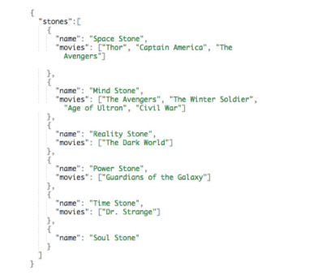


Exercise 43: Dealing with JSON Files
------------------------------------

In this exercise, we will extract details such as the names of students,
their qualifications, and additional qualifications from a JSON file.
Follow these steps to implement this exercise:

1.  Open a Jupyter notebook.

2.  Insert a new cell and import `json`. Pass the location of
    the file mentioned using the following commands:

    ```
    import json
    from pprint import pprint
    data = json.load(open('data_ch4/sample_json.json'))
    pprint(data)
    ```

    The preceding code generates the following output:

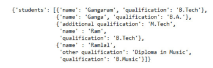


3.  To extract the names of the students, add the following code:

    ```
    [dt['name'] for dt in data['students']]
    ```


    The preceding code generates the following output:

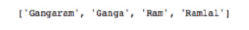


4.  To extract their qualifications, enter the following code:

    ```
    [dt['qualification'] for dt in data['students']]
    ```


    The preceding code generates the following output:

    
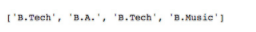

5.  To extract their additional qualifications, enter the following
    code. Remember: not every student will have additional
    qualifications. Thus, we need to check this separately. Add the
    following code to implement this:

    ```
    [dt['additional qualification'] if 'additional qualification' in dt.keys() else None for dt in data['students']]
    ```


    The preceding code generates the following output:


As JSON objects are similar to the dictionary data structure of Python,
they can be effectively stored in a pandas DataFrame in most cases. In
the following activity, we will learn how to store JSON files in a
pandas DataFrame and extract sentiment scores from them.

Activity 8: Dealing with Online JSON Files
------------------------------------------

In this activity, we will fetch JSON files from online, extract
comments, and evaluate the sentiment scores of each of them. We will
make use of the TextBlob library. Follow these steps to implement this
activity:

1.  Import the necessary libraries.
2.  Fetch the data from <https://bit.ly/2TJ1T4H> the requests library.
3.  Create a DataFrame from the fetched data.
4.  Translate the comments in the data into English.
5.  Make use of the TextBlob library to find the sentiment of each
    comment and display it.


We just learned how to detect the sentiments of comments present in a
fetched JSON file. In the next section, we will learn about XML.

XML
---

Just like HTML, XML is another kind of markup language that stores data
in between tags.The following figure depicts what an XML file looks like:

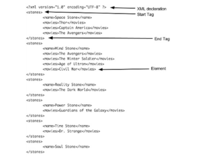

An XML file can be represented as a tree called an XML tree. This XML
tree begins with the root element (parent). This root element further
branches into child elements. Each element of the XML file is a node in
the XML tree. Those elements that don\'t have any children are leaf
nodes. The following figure clearly differentiates between an original
XML file and a tree representation of an XML file:

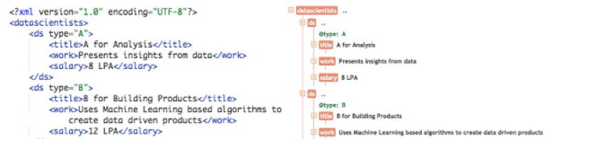


Exercise 44: Dealing with a Local XML File
------------------------------------------

In this exercise, we will parse an XML file and print various things,
such as the names of employees, the organizations they work for, and the
total salaries of all employees. Follow these steps to implement this
exercise:

1.  Open a Jupyter notebook.

2.  Insert a new cell, import `xml.etree.ElementTree`, and
    pass the location of the XML file using the following code:

    ```
    import xml.etree.ElementTree as ET
    tree = ET.parse('data_ch4/sample_xml_data.xml')
    root = tree.getroot()
    root
    ```


    The preceding code generates the following output:

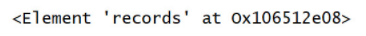


3.  To check the tag of the fetched element, type the following code:

    ```
    root.tag
    ```


    The preceding code generates the following output:


4.  Look for the `name` and `company` tags in the
    XML and print the data enclosed within them:

    ```
    for record in root.findall('record')[:20]:
        print(record.find('name').text, "---",record.find('company').text)
    ```


    The preceding code generates the following output:


5.  Create a list consisting of the salaries of all employees. Use
    `numpy` to find out the sum of the salaries:

    ```
    import numpy as np
    np.sum([int(record.find('salary').text.replace('$','').replace(',','')) for record in root.findall('record')])
    ```


Exercise 45: Collecting Data Using APIs
---------------------------------------

In this exercise, we will extract carbon intensities from December 30,
2018, to January 3, 2019, using an API. Follow these steps to implement
this exercise:

1.  Open a Jupyter notebook.

2.  Import the necessary packages. Construct the corresponding URL and
    call it:

    ```
    http = urllib3.PoolManager()
    start_dt = '2018-12-30T12:35Z'
    end_dt = '2019-01-03T12:35Z'
    rrq = http.request('GET', 'https://api.carbonintensity.org.uk/intensity/'+start_dt+'/'+end_dt, \
                       headers = {'Accept': 'application/json'})
    rrq.status
    ```

    The preceding code generates the following output:

    
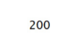


3.  Load the `json` data, insert a new cell, and add the
    following code to implement this:

    ```
    data = json.loads(rrq.data)
    pprint(data)
    ```


    The preceding code generates the following output:

    
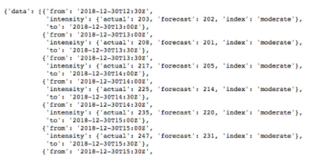


4.  To create the `DataFrame` of the fetched data and print
    it, add the following code:

    ```
    pd.DataFrame(data['data'])
    ```

    The preceding code generates the following output:

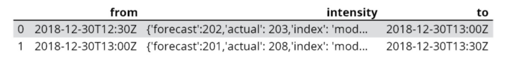


Activity 9: Extracting Data from Twitter
----------------------------------------

In this activity, we will extract tweets using the Tweepy library,
calculate sentiment scores, and visualize the tweets using a word cloud.
Follow these to implement this activity:

1.  Log in to your Twitter account with your credentials.

2.  Visit <https://dev.twitter.com/apps/new> and fill in the form by
    completing the necessary fields.

3.  Submit the form and receive the keys and tokens.

4.  Use these keys and tokens in your application when making an API
    call for `#WorldWaterDay`.

5.  Import the necessary libraries.

6.  Fetch the data using the keys and tokens.

7.  Create a DataFrame consisting of tweets.

8.  Filter out those tweets written in English.

9.  Calculate sentiment scores for each tweet using the TextBlob
    library.

10. Visualize the tweets using a word cloud.


We just learned how to extract data from twitter, analyze tweets, and
create a word cloud out of them. In the next section, we will look at
how to extract data from local files.

Extracting Data from Local Files
--------------------------------

Data exists in various kinds of formats, such as PDF, DOCX, Excel, PPTX,
and images. Extracting content from such files is often a tedious job.
Let\'s do an exercise to learn how we can effectively retrieve data from
these files.

Exercise 46: Extracting Data from Local Files
---------------------------------------------

In this exercise, we will extract data from different local files, such
as a PDF file, an image file, an Excel file, and a Word file. Follow
these steps to implement this exercise:

1.  Open a Jupyter notebook.

2.  Import the `textract` library to extract text from a PDF
    file:

    ```
    import textract
    text = textract.process("data_ch4/Flowchart_Selecting_Model_Type.pdf")
    text
    ```


    The preceding code generates the following output:

    
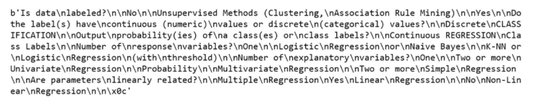


3.  Import the `PIL` and `pytesseract` libraries to
    extract text from the image file:

    ```
    from PIL import Image
    import pytesseract
    print(pytesseract.image_to_string(Image.open('data_ch4/ChatBot.png')))
    ```


    The preceding code generates the following output:


4.  To extract text from the image file using `textract`, add
    the following code:

    ```
    import textract
    textract.process("data_ch4/ChatBot.png")
    ```


    The preceding code generates the following output:

    
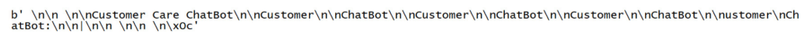


5.  To extract data from an Excel file, add the following code:

    ```
    import pandas as pd
    data = pd.read_excel('data_ch4/sample_excel.xlsx', sheet=1)
    data.head()
    ```


    The preceding code generates the following output:

    
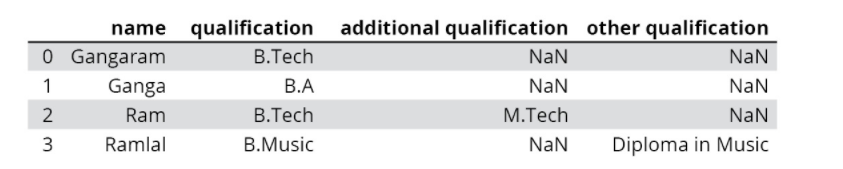


6.  To extract data from a Word document, add the following code:

    ```
    import textract
    textract.process("data_ch4/sample_word_document.docx")
    ```


    The preceding code generates the following output:


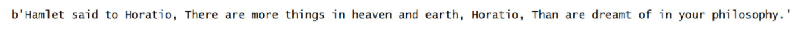

We just learned how to extract data from different local files with the
help of different libraries. In the next section, we will walk through
an exercise in which we perform various operations on local files.

Exercise 47: Performing Various Operations on Local Files
---------------------------------------------------------

In this exercise, we will perform various file operations, such as open,
write, read, append, and close, on local files. Follow these steps to
implement this exercise:

1.  Open a Jupyter notebook.

2.  First, we create a text file and write a little content in it. Add
    the following code to implement this:


    ```
    fp = open('data_ch4/sample_text.txt', 'w') 
    fp.write("I love text mining\n")
    fp.close()
    ```


3.  To add more text into an existing text file, add the following code:


    ```
    fp = open('data_ch4/sample_text.txt', 'a')
    fp.write("I am learning Natural Language Processing\n")
    fp.close()
    ```


4.  To read the content from the text file, add the following code:

    ```
    fp = open('data_ch4/sample_text.txt', 'r')
    fp.readlines()
    ```


    The preceding code generates the following output:

    


5.  To open text files with various encodings, add the following code:

    ```
    import nltk
    nltk.download('unicode_samples')
    file_location = nltk.data.find('corpora/unicode_samples/polish-lat2.txt')
    fp = open(file_location,'r', encoding='latin2')
    fp.readlines()
    ```


    The preceding code generates the following output:

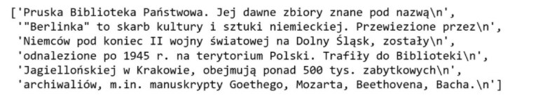


6.  To read these files line by line, insert a new cell and add the
    following code:

    ```
    for line in open(file_location,'r', encoding='latin2'):
        print(line)
    ```


    The preceding code generates the following output:

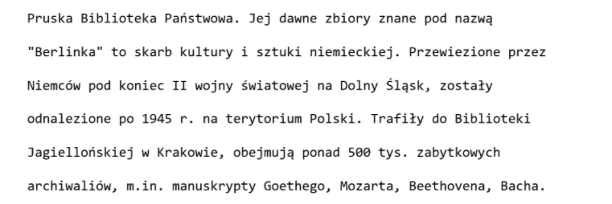


7.  To close the opened file, add the following
    code:


    ```
    fp.close()
    ```

We just learned how to perform various operations on a local file.


#### Summary


In this lab, you have learned ways to collect data by scraping web
pages. Moreover, you were introduced to various types of semi-structured
data formats, namely JSON and XML. Different ways of retrieving data in
real time from a website such as Twitter have been explained with
examples. Finally, you were introduced to various methods to deal with
different kinds of local files, such as PDF, Word documents, text files,
and Excel files.

In the next lab, you will learn about topic modeling, which is an
unsupervised natural language processing technique. It helps in grouping
the documents according to the topic detected in them.
