Appendix
========


About
-----

This section is included to assist the students to perform the
activities in the book. It includes detailed steps that are to be
performed by the students to achieve the objectives of the activities.


1. Introduction to Natural Language Processing
==============================================


Activity 1: Preprocessing of Raw Text
-------------------------------------

**Solution**

Let\'s perform preprocessing on a text corpus. To implement this
activity, follow these steps:

1.  Open a Jupyter notebook.

2.  Insert a new cell and add the following code to import the necessary
    libraries:


    ```
    import nltk
    nltk.download('punkt')
    nltk.download('averaged_perceptron_tagger')
    nltk.download('stopwords')
    nltk.download('wordnet')
    from nltk import word_tokenize
    from nltk.stem.wordnet import WordNetLemmatizer
    from nltk.corpus import stopwords
    from autocorrect import spell
    from nltk.wsd import lesk
    from nltk.tokenize import sent_tokenize
    import string
    ```


3.  Read the content of `file.txt` and store it in a variable
    named \"`sentence`\". Insert a new cell and add the
    following code to implement this:


    ```
    sentence = open("data_ch1/file.txt", 'r').read()
    ```


4.  Apply tokenization on the given text corpus. Insert a new cell and
    add the following code to implement this:


    ```
    words = word_tokenize(sentence)
    ```


5.  To print the list of tokens, we insert a new cell and add the
    following code:


    ```
    print(words[0:20])
    ```


    The code generates the following output:

    
    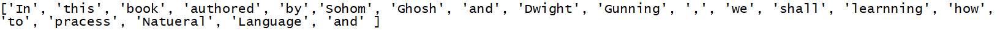


    In the preceding figure, we can see the initial 20 tokens of our
    text corpus.

6.  To do the spelling correction in our given text corpus, we loop
    through each token and correct tokens that are wrongly spelled.
    Insert a new cell and add the following code to implement this:


    ```
    corrected_sentence = ""
    corrected_word_list = []
    for wd in words:
        if wd not in string.punctuation:
            wd_c = spell(wd)
            if wd_c != wd:
                print(wd+" has been corrected to: "+wd_c)
                corrected_sentence = corrected_sentence+" "+wd_c
                corrected_word_list.append(wd_c)
            else:
                corrected_sentence = corrected_sentence+" "+wd
                corrected_word_list.append(wd)
        else:
            corrected_sentence = corrected_sentence + wd
            corrected_word_list.append(wd)
    ```


    The code generates the following output:

    
    


7.  To print the corrected text corpus, we add a new cell and write the
    following code:


    ```
    corrected_sentence
    ```


    The code generates the following output:

    
    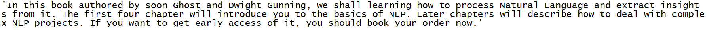


8.  To print a list of the initial 20 tokens of the corrected words, we
    insert a new cell and add the following code:


    ```
    print(corrected_word_list[0:20])
    ```


    The code generates the following output:

    
    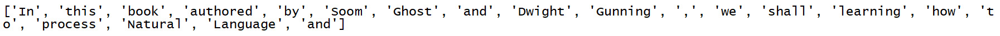


9.  We want to add a PoS tag to all the corrected words in the list. In
    order to do this, we insert a new cell and add the following code:


    ```
    print(nltk.pos_tag(corrected_word_list))
    ```


    The code generates the following output:

    
    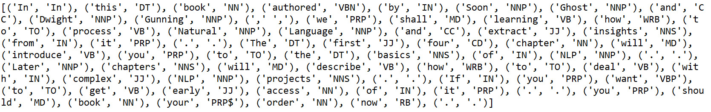


10. From the list, we now want to remove the stop words. In order to do
    that, we insert a new cell and add the following code:


    ```
    stop_words = stopwords.words('English')
    corrected_word_list_without_stopwords = []
    for wd in corrected_word_list:
        if wd not in stop_words:
            corrected_word_list_without_stopwords.append(wd)
    corrected_word_list_without_stopwords[:20]
    ```


    The code generates the following output:

    
    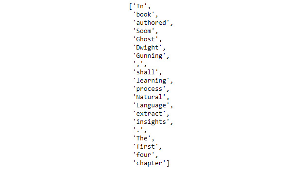


    In the preceding figure, we can see that the stop words are being
    removed and a new list is being returned.

11. Now, with this list, if we want to apply the stemming process, then
    we insert a new cell and add the following code:


    ```
    stemmer = nltk.stem.PorterStemmer()
    corrected_word_list_without_stopwords_stemmed = []
    for wd in corrected_word_list_without_stopwords:
        corrected_word_list_without_stopwords_stemmed.append(stemmer.stem(wd))
    corrected_word_list_without_stopwords_stemmed[:20]
    ```


    This code generates the following output:

    
    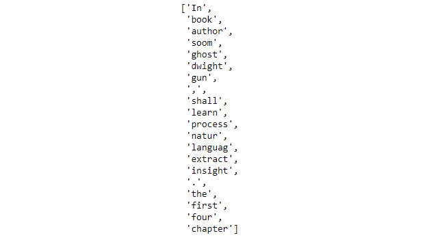


    In the preceding code, we looped through each word in the
    `corrected_word_list_without_stopwords` list and applied
    stemming to them. The preceding figure shows the list of the initial
    20 stemmed words.

12. Also, if we want to apply the lemmatization process to the corrected
    word list, we do so by inserting a new cell and adding the following
    code:


    ```
    lemmatizer = WordNetLemmatizer()
    corrected_word_list_without_stopwords_lemmatized = []
    for wd in corrected_word_list_without_stopwords:
        corrected_word_list_without_stopwords_lemmatized.append(lemmatizer.lemmatize(wd))
    corrected_word_list_without_stopwords_lemmatized[:20]
    ```


    This code generates the following output:

    
    


    In the preceding code, we looped through each word in the
    `corrected_word_list_without_stopwords` list and applied
    lemmatization to them. The preceding figure shows the list of the
    initial 20 lemmatized words.

13. To detect the sentence boundary in the given text corpus, we make
    use of the `sent_tokenize()` method. Insert a new cell and
    add the following code to implement this:


    ```
    print(sent_tokenize(corrected_sentence))
    ```


    The above code generates the following output:


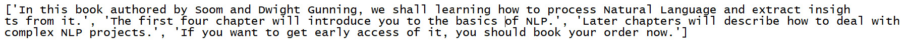


We have learned about and achieved the preprocessing of given data.


2. Basic Feature Extraction Methods
===================================


Activity 2: Extracting General Features from Text
-------------------------------------------------

**Solution**

Let\'s extract general features from the given text. Follow these steps
to implement this activity:

1.  Open a Jupyter notebook.

2.  Insert a new cell and add the following code to import the necessary
    libraries:


    ```
    import pandas as pd
    from string import punctuation
    import nltk
    nltk.download('tagsets')
    from nltk.data import load
    nltk.download('averaged_perceptron_tagger')
    from nltk import pos_tag
    from nltk import word_tokenize
    from collections import Counter
    ```


3.  Now let\'s see what different kinds of PoS nltk provides. Add the
    following code to do this:


    ```
    tagdict = load('help/tagsets/upenn_tagset.pickle')
    list(tagdict.keys())
    ```


    The code generates the following output:

    
    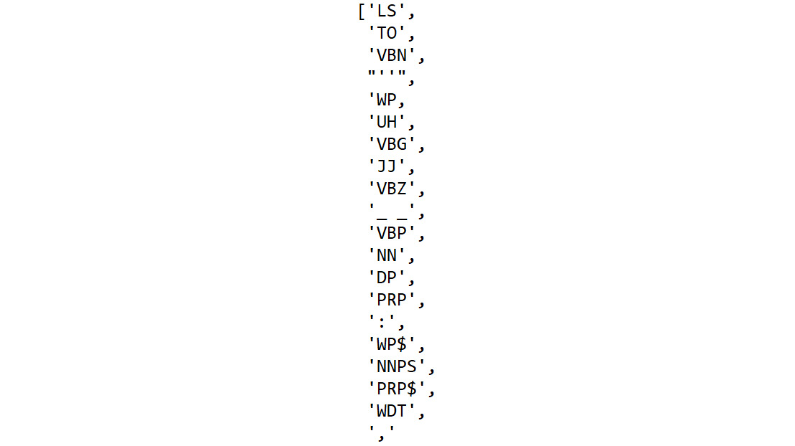


4.  The number of occurrences of each PoS is calculated by iterating
    through each document and annotating each word with the
    corresponding `pos` tag. Add the following code to
    implement this:


    ```
    data = pd.read_csv('data_ch2/data.csv', header = 0)
    pos_di = {}
    for pos in list(tagdict.keys()):
        pos_di[pos] = []
    for doc in data['text']:
    di = Counter([j for i,j in pos_tag(word_tokenize(doc))])
    for pos in list(tagdict.keys()):
    pos_di[pos].append(di[pos])
    feature_df = pd.DataFrame(pos_di)
    feature_df.head()
    ```


    The code generates the following output:

    
    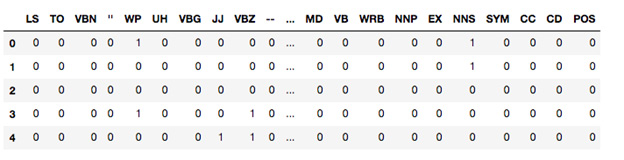


5.  To calculate the number of punctuation marks present in each text of
    the DataFrame, add the following code:


    ```
    feature_df['num_of_unique_punctuations'] = data['text'].apply(lambda x : len(set(x).intersection(set(punctuation))))
    feature_df['num_of_unique_punctuations'].head()
    ```


    The code generates the following output:

    
    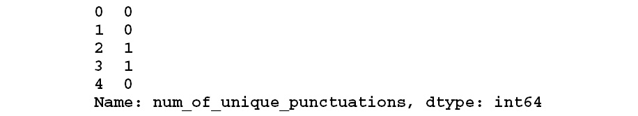


6.  To calculate the number of capitalized words, add the following
    code:


    ```
    feature_df['number_of_capital_words'] =data['text'].apply(lambda x : \
                                                len([word for word in word_tokenize(str(x)) if word[0].isupper()]))
    feature_df['number_of_capital_words'].head()
    ```


    The code generates the following output:

    
    


7.  To calculate the number of uncapitalized words, add the following
    code:


    ```
    feature_df['number_of_small_words'] =data['text'].apply(lambda x : \
                                                len([word for word in word_tokenize(str(x)) if word[0].islower()]))
    feature_df['number_of_small_words'].head()
    ```


    The code generates the following output:

    
    


8.  To calculate the number of letters in the DataFrame, use the
    following code:


    ```
    feature_df['number_of_alphabets'] = data['text'].apply(lambda x : len([ch for ch in str(x) if ch.isalpha()]))
    feature_df['number_of_alphabets'].head()
    ```


    The code generates the following output:

    
    


9.  To calculate the number of digits in the DataFrame, add the
    following code:


    ```
    feature_df['number_of_digits'] = data['text'].apply(lambda x : len([ch for ch in str(x) if ch.isdigit()]))
    feature_df['number_of_digits'].head()
    ```


    The code generates the following output:

    
    


10. To calculate the number of words in the DataFrame, add the following
    code:


    ```
    feature_df['number_of_words'] = data['text'].apply(lambda x : len(word_tokenize(str(x))))
    feature_df['number_of_words'].head()
    ```


    The code generates the following output:

    
    


11. To calculate the number of whitespaces in the DataFrame, add the
    following code:


    ```
    feature_df['number_of_white_spaces'] = data['text'].apply(lambda x : len(str(x).split(' '))-1)
    feature_df['number_of_white_spaces'].head()
    ```


    The code generates the following output:

    
    


12. Now let\'s view the full feature set we have just created. Add the
    following code to implement this:


    ```
    feature_df.head()
    ```


    The code generates the following output:


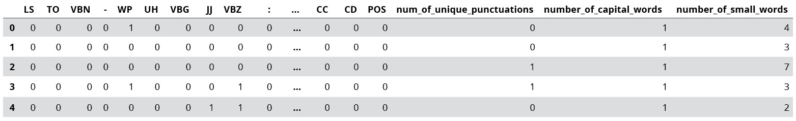


Activity 3: Extracting Specific Features from Texts
---------------------------------------------------

**Solution**

Let\'s extract the special features from the text. Follow these steps to
implement this activity:

1.  Open a Jupyter notebook.

2.  Import the necessary packages and declare a
    `newsgroups_data_sample` variable with the help of the
    following code:


    ```
    import nltk
    nltk.download('stopwords')
    from nltk.corpus import stopwords
    from nltk import word_tokenize
    from nltk.stem import WordNetLemmatizer
    from sklearn.feature_extraction.text import TfidfVectorizer
    from sklearn.feature_extraction.text import CountVectorizer
    from sklearn.datasets import fetch_20newsgroups
    import re
    import string
    import pandas as pd
    newsgroups_data_sample = fetch_20newsgroups(subset='train')
    lemmatizer = WordNetLemmatizer()
    ```


3.  In order to store the text data in a DataFrame, insert a new cell
    and add the following code:


    ```
    newsgroups_text_df = pd.DataFrame({'text' : newsgroups_data_sample['data']})
    newsgroups_text_df.head()
    ```


    The code generates the following output:

    
    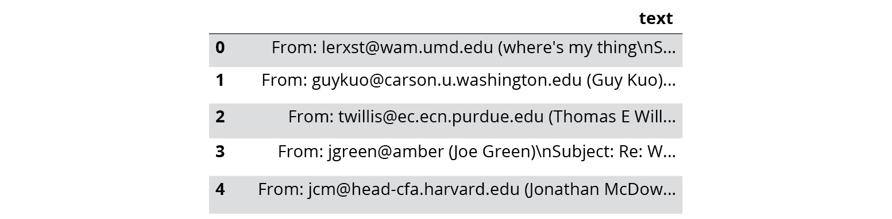


4.  The data present in the DataFrame is not clean. In order to clean
    it, insert a new cell and add the following code:


    ```
    stop_words = stopwords.words('english')
    stop_words = stop_words + list(string.printable)
    newsgroups_text_df['cleaned_text'] = newsgroups_text_df['text'].apply(\
    lambda x : ' '.join([lemmatizer.lemmatize(word.lower()) \
        for word in word_tokenize(re.sub(r'([^\s\w]|_)+', ' ', str(x))) if word.lower() not in stop_words]))
    ```


5.  Now that we have clean data, we add the following code to create a
    BoW model:


    ```
    bag_of_words_model = CountVectorizer(max_features= 20)
    bag_of_word_df = pd.DataFrame(bag_of_words_model.fit_transform(newsgroups_text_df['cleaned_text']).todense())
    bag_of_word_df.columns = sorted(bag_of_words_model.vocabulary_)
    bag_of_word_df.head()
    ```


    The code generates the following output:

    
    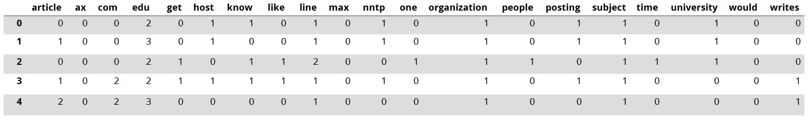


6.  To create a TF-IDF model, insert a new cell and add the following
    code:


    ```
    tfidf_model = TfidfVectorizer(max_features=20)
    tfidf_df = pd.DataFrame(tfidf_model.fit_transform(newsgroups_text_df['cleaned_text']).todense())
    tfidf_df.columns = sorted(tfidf_model.vocabulary_)
    tfidf_df.head()
    ```


    The code generates the following output:

    
    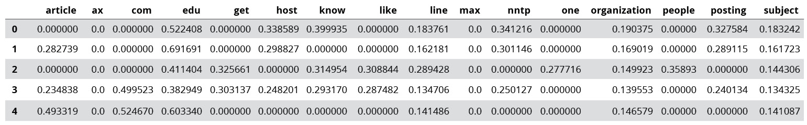


7.  Once both the models are created, we need to compare them. To check
    the most informative terms for the second document, as ascertained
    by the BoW model, we write the following code:


    ```
    rw = 2
    list(bag_of_word_df.columns[bag_of_word_df.iloc[rw,:] == bag_of_word_df.iloc[rw,:].max()])
    ```


    The code generates the following output:

    
    


8.  To check the most informative terms for the second document, as
    ascertained by the TF-IDF model, we write the following code:


    ```
    rw = 2
    list(tfidf_df.columns[tfidf_df.iloc[rw,:] == tfidf_df.iloc[rw,:].max()])
    ```


    The code generates the following output:

    
    


9.  To check the occurrence of the word \"line\" in the documents, we
    write the following code:


    ```
    bag_of_word_df[bag_of_word_df['line']!=0].shape[0]
    ```


    The code generates the following code:

    
    


10. To check the occurrence of the word \"edu\" in the documents, we
    write the following code:


    ```
    bag_of_word_df[bag_of_word_df['edu']!=0].shape[0]
    ```


    The code generates the following output:


As we can see from the last two steps, the difference arises because the
word \"line\" occurs in 11,282 documents, whereas the word \"edu\"
occurs in 7,393 documents only. Thus, the word \"edu\" is rarer and is
more informative than the word \"line.\" Unlike the BoW model, the
TF-IDF model is able to capture this meticulous detail. In most cases,
TF-IDF is preferred over BoW.


Activity 4: Text Visualization
------------------------------

**Solution**

1.  Open a Jupyter notebook.

2.  Insert a new cell and add the following code to import the necessary
    libraries:


    ```
    from wordcloud import WordCloud, STOPWORDS
    import matplotlib.pyplot as plt
    %matplotlib inline
    from nltk import word_tokenize
    from nltk.stem import WordNetLemmatizer
    import nltk
    from collections import Counter
    import re
    ```


3.  To fetch the dataset and read its content, add the following code:


    ```
    text = open('data_ch2/text_corpus.txt', 'r').read()
    text
    ```


    The code generates the following output:

    
    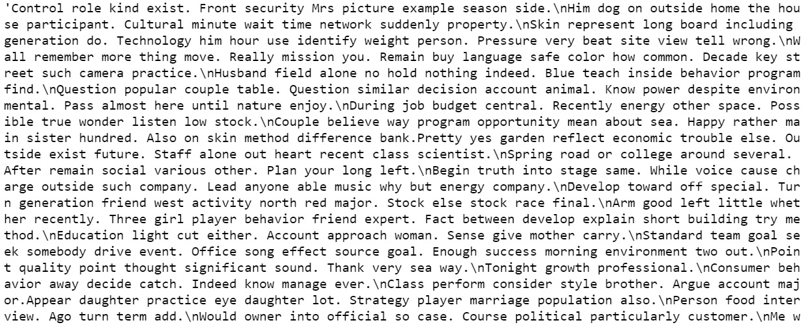


4.  The text in the fetched data is not clean. In order to clean it, we
    make use of various pre-processing steps, such as tokenization and
    lemmatization. Add the following code to implement this:


    ```
    nltk.download('wordnet')
    lemmatize = WordNetLemmatizer()
    cleaned_lemmatized_tokens = [lemmatizer.lemmatize(word.lower()) \
                                 for word in word_tokenize(re.sub(r'([^\s\w]|_)+', ' ', text))]
    ```


5.  Now we need to check the set of unique words, along with their
    frequencies, to find the 50 most frequently occurring words. Add the
    following code to implement this:


    ```
    Counter(cleaned_lemmatized_tokens).most_common(50)
    ```


    The code generates the following output:

    
    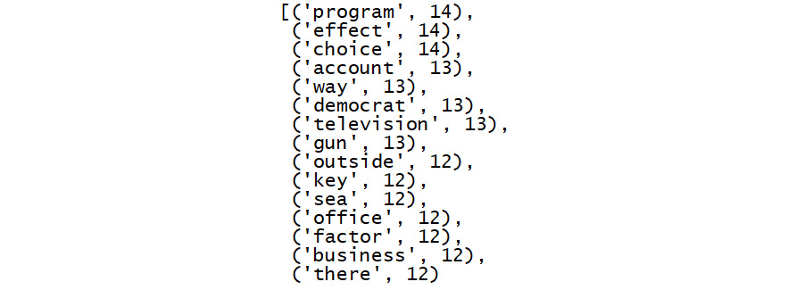


6.  Once we get the set of unique words along with their frequencies, we
    will remove the stop words. After that, we generate the word cloud
    for the top 50 most frequent words. Add the following code to
    implement this:


    ```
    stopwords = set(STOPWORDS)
    cleaned_text = ' '.join(cleaned_lemmatized_tokens)
    wordcloud = WordCloud(width = 800, height = 800, 
                    background_color ='white', 
                    max_words=50,
                    stopwords = stopwords, 
                    min_font_size = 10).generate(cleaned_text)
    plt.imshow(wordcloud, interpolation='bilinear')
    plt.axis("off")
    plt.show()
    ```


    The code generates the following output:


As you can see in the figure, words that occur more frequently, such as
\"program,\" \"effect,\" and \"choice,\" appear in larger sizes in the
word cloud. Thus, the word cloud for the given text corpus is justified.


3. Developing a Text classifier
===============================


Activity 5: Developing End-to-End Text Classifiers
--------------------------------------------------

**Solution**

Let\'s build an end-to-end classifier that helps classify Wikipedia
comments. Follow these steps to implement this activity:

1.  Open a Jupyter notebook.

2.  Insert a new cell and add the following code to import the necessary
    packages:


    ```
    import pandas as pd
    import seaborn as sns
    import matplotlib.pyplot as plt
    %matplotlib inline
    import re
    import string
    from nltk import word_tokenize
    from nltk.corpus import stopwords
    from nltk.stem import WordNetLemmatizer
    from sklearn.feature_extraction.text import TfidfVectorizer
    from sklearn.model_selection import train_test_split
    from pylab import *
    import nltk
    import warnings
    warnings.filterwarnings('ignore')
    from sklearn.metrics import accuracy_score,roc_curve,classification_report,confusion_matrix,precision_recall_curve,auc
    ```


3.  In this step, we will read a data file. It has two columns:
    **comment\_text** and **toxic**. The **comment\_text** column
    contains various user comments and the **toxic** column contains
    their corresponding labels. Here, label 0 denotes that a comment is
    not toxic and label 1 denotes that a comment is toxic. Add the
    following code to do this:


    ```
    data = pd.read_csv('data_ch3/train_comment_small.csv')
    data.head()
    ```


    The preceding code generates the following output:

    
    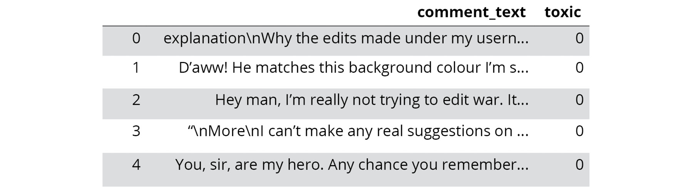


4.  We\'ll now create a generic function for all classifiers, called
    `clf_model`. It takes four inputs: type of model, features
    of the training dataset, labels of the training dataset, and
    features of the validation dataset. It returns predicted labels,
    predicted probabilities, and the model it has been trained on. Add
    the following code to do this:


    ```
    def clf_model(model_type, X_train, y_train, X_valid):
        model = model_type.fit(X_train,y_train)
        predicted_labels = model.predict(X_valid)
        predicted_probab = model.predict_proba(X_valid)[:,1]
        return [predicted_labels,predicted_probab, model]
    ```


5.  Furthermore, another function is defined, called
    `model_evaluation`. It takes three inputs: actual values,
    predicted values, and predicted probabilities. It prints a confusion
    matrix, accuracy, f1-score, precision, recall scores, and area under
    the ROC curve. It also plots the ROC curve:


    ```
    def model_evaluation(actual_values, predicted_values, predicted_probabilities):
        cfn_mat = confusion_matrix(actual_values,predicted_values)
        print("confusion matrix: \n",cfn_mat)
        print("\naccuracy: ",accuracy_score(actual_values,predicted_values))
        print("\nclassification report: \n", classification_report(actual_values,predicted_values))
        fpr,tpr,threshold=roc_curve(actual_values, predicted_probabilities)
        print ('\nArea under ROC curve for validation set:', auc(fpr,tpr))
        fig, ax = plt.subplots(figsize=(6,6))
        ax.plot(fpr,tpr,label='Validation set AUC')
        plt.xlabel('False Positive Rate')
        plt.ylabel('True Positive Rate')
        ax.legend(loc='best')
        plt.show()
    ```


6.  In this step, we\'ll use a lambda function to extract tokens from
    each text in this DataFrame (called data), check whether any of
    these tokens are stop words, lemmatize them, and concatenate them
    side by side. We\'ll use the join function to concatenate a list of
    words into a single sentence. We\'ll use a regular expression (re)
    to replace anything other than letters, digits, and white spaces
    with blank space. Add the following code to implement this:


    ```
    lemmatizer = WordNetLemmatizer()
    stop_words = stopwords.words('english')
    stop_words = stop_words + list(string.printable)
    data['cleaned_comment_text'] = data['comment_text'].apply(\
    lambda x : ' '.join([lemmatizer.lemmatize(word.lower()) \
        for word in word_tokenize(re.sub(r'([^\s\w]|_)+', ' ', str(x))) if word.lower() not in stop_words]))
    ```


7.  Now, we\'ll create a tf-idf matrix representation of these cleaned
    texts. Add the following code to do this:


    ```
    tfidf_model = TfidfVectorizer(max_features=500)
    tfidf_df = pd.DataFrame(tfidf_model.fit_transform(data['cleaned_comment_text']).todense())
    tfidf_df.columns = sorted(tfidf_model.vocabulary_)
    tfidf_df.head()
    ```


    The preceding code generates the following output:

    
    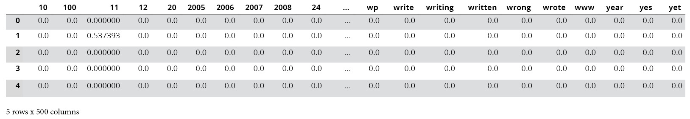


8.  Use sklearn\'s `train_test_split` function to divide the
    dataset into training and validation sets. Add the following code to
    do this:


    ```
    X_train, X_valid, y_train, y_valid = train_test_split(tfidf_df, data['toxic'], test_size=0.2, random_state=42,stratify = data['toxic'])
    ```


9.  Here, we\'ll train a logistic regression model using sklearn\'s
    `LogisticRegression()` function and evaluate it for the
    validation set. Add the following code:


    ```
    from sklearn.linear_model import LogisticRegression
    logreg = LogisticRegression()
    results = clf_model(logreg, X_train, y_train, X_valid)
    model_evaluation(y_valid, results[0], results[1])
    ```


    The preceding code generates the following output:

    
    


10. We\'ll train a random forest model using sklearn\'s
    `RandomForestClassifier()` function and evaluate it for
    the validation set. Add the following code:


    ```
    from sklearn.ensemble import RandomForestClassifier 
    rfc = RandomForestClassifier(n_estimators=20,max_depth=4,max_features='sqrt',random_state=1)
    results = clf_model(rfc, X_train, y_train, X_valid)
    model_evaluation(y_valid, results[0], results[1])
    model_rfc = results[2]
    ```


    The preceding code generates the following output:

    
    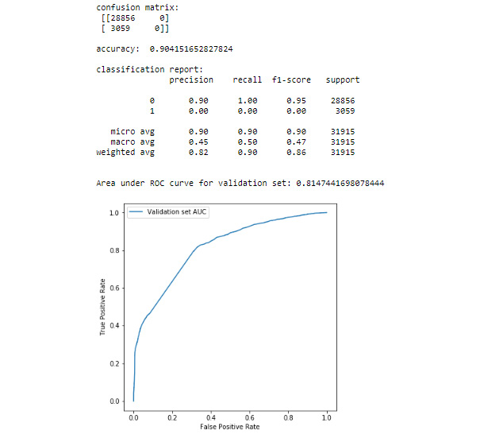


11. Moreover, we extract important features, which are the tokens or
    words that play a more vital role in determining whether a comment
    will be toxic. Add the following code:


    ```
    word_importances = pd.DataFrame({'word':X_train.columns,'importance':model_rfc.feature_importances_})
    word_importances.sort_values('importance', ascending = False).head(4)
    ```


    The preceding code generates the following output:

    
    


12. We train an XGBoost model using the `XGBClassifier()`
    function and evaluate it for the validation set. Add the following
    code to do this:


    ```
    from xgboost import XGBClassifier
    xgb_clf=XGBClassifier(n_estimators=20,learning_rate=0.03,max_depth=5,subsample=0.6,colsample_bytree= 0.6,reg_alpha= 10,seed=42)
    results = clf_model(xgb_clf, X_train, y_train, X_valid)
    model_evaluation(y_valid, results[0], results[1])
    model_xgb = results[2]
    ```


    The preceding code generates the following output:

    
    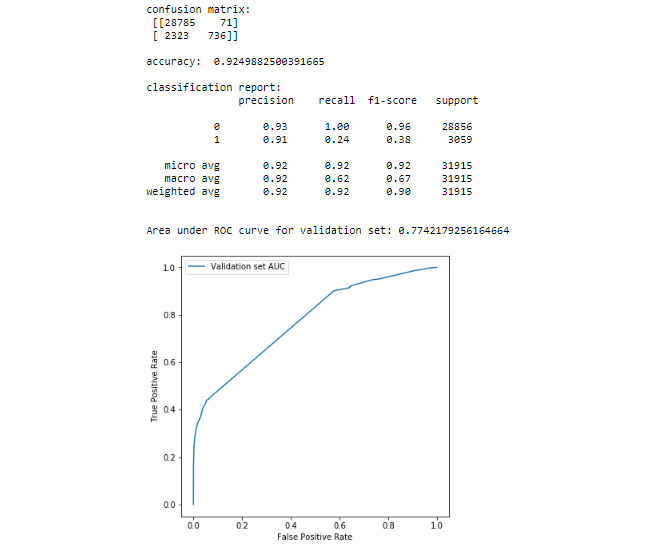


13. Moreover, we extract the importance of features, that is, tokens or
    words that play a more vital role in determining whether a comment
    is toxic. Add the following code to do this:


    ```
    word_importances = pd.DataFrame({'word':X_train.columns,'importance':model_xgb.feature_importances_})
    word_importances.sort_values('importance', ascending = False).head(4)
    ```


    The preceding code generates the following output:


4. Collecting Text Data from the Web
====================================


Activity 6: Extracting Information from an Online HTML Page
-----------------------------------------------------------

**Solution**

Let\'s extract the data from an online source and analyze it. Follow
these steps to implement this activity:

1.  Open a Jupyter notebook.

2.  Import the `requests` and `BeautifulSoup`
    libraries. Pass the URL to `requests` with the following
    command. Convert the fetched content into HTML format using
    BeautifulSoup\'s HTML parser. Add the following code to do this:


    ```
    import requests
    from bs4 import BeautifulSoup
    r = requests.get('https://en.wikipedia.org/wiki/Rabindranath_Tagore')
    soup = BeautifulSoup(r.text, 'html.parser')
    ```


3.  To extract the list of headings, look for the `h3` tag.
    Here, we only need the first six headings. We will look for a
    `span` tag that has a `class` attribute with the
    following set of commands:


    ```
    for ele in soup.find_all('h3')[:6]:
        tx = BeautifulSoup(str(ele),'html.parser').find('span', attrs={'class':"mw-headline"})
        if tx is not None:
            print(tx['id'])
    ```


    The preceding code generates the following output:

    
    


4.  To extract information regarding works by Tagore, look for the
    `table` tag. Traverse through the rows and columns of
    these tables and extract the texts by entering the following code:


    ```
    table = soup.find_all('table')[1]
    for row in table.find_all('tr'):
        columns = row.find_all('td')
        if len(columns)>0:
            columns = columns[1:]
        print(BeautifulSoup(str(columns), 'html.parser').text.strip())
    ```


    The preceding code generates the following output:

    
    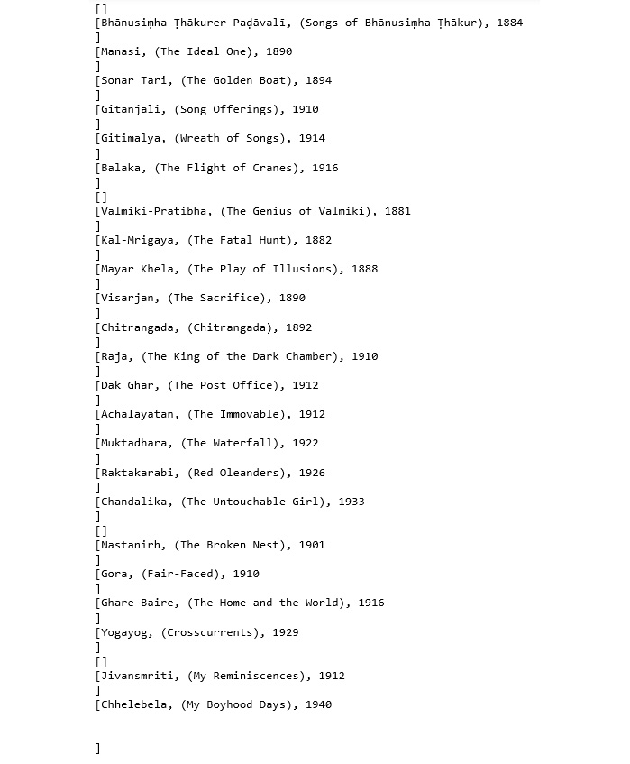


5.  To extract the list of universities named after Tagore, look for the
    `ol` tag. Add the following code to implement this:


    ```
    [BeautifulSoup(str(i),'html.parser').text.strip() for i in soup.find('ol') if i!='\n']
    ```


    The preceding code generates the following output:


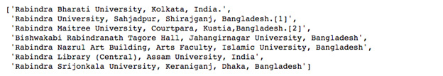


Activity 7: Extracting and Analyzing Data Using Regular Expressions
-------------------------------------------------------------------

**Solution**

Let\'s extract the data from an online source and analyze various
things. Follow these steps to implement this activity:

1.  To begin, let\'s try to collect data using `requests` with
    the following code:


    ```
    import urllib3
    import requests
    from bs4 import BeautifulSoup
    r = requests.get('https://www.packtpub.com/books/info/packt/faq')
    r.status_code
    ```


    The preceding code generates the following output:

    
    


    To check the text data of the fetched content, type the following
    code:


    ```
    r.text
    ```


    The preceding code generates the following output:

    
    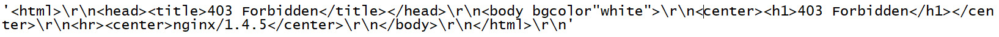


    Here, **403** means forbidden. Thus, we will be using
    `urllib3`.

2.  Let\'s extract data using `urllib3` and store it in a soup
    with the following commands:


    ```
    http = urllib3.PoolManager()
    rr = http.request('GET', 'https://www.packtpub.com/books/info/packt/faq')
    rr.status
    rr.data[:1000]
    ```


    The preceding code generates the following output:

    
    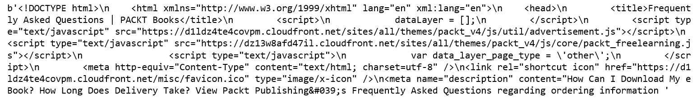


3.  A list of questions can be obtained by looking for a `div`
    tag that has a `class = faq-item-question-text float-left`
    attribute, as shown here:


    ```
    soup = BeautifulSoup(rr.data, 'html.parser')
    questions = [question.text.strip() for question in soup.find_all('div',attrs={"class":"faq-item-question-text float-left"})]
    questions
    ```


    The above code generates the following output:

    
    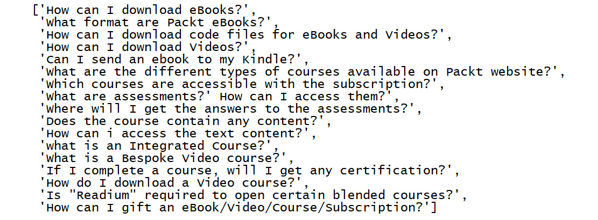


    A list of answers can be obtained by looking for a `div`
    tag that has a `class = faq-item-answer `attribute:


    ```
    answers = [answer.text.strip() for answer in soup.find_all('div',attrs={"class":"faq-item-answer"})]
    answers
    ```


    The preceding code generates the following output:

    
    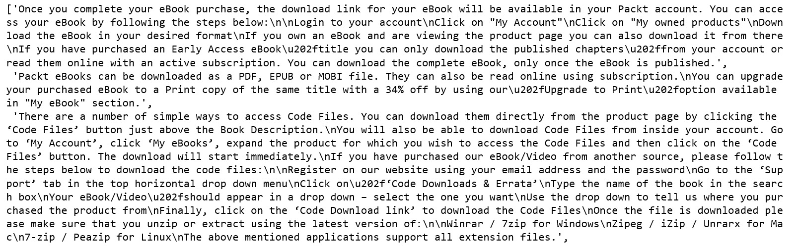


4.  Next, we\'ll create a DataFrame consisting of these questions and
    answers:


    ```
    import pandas as pd
    pd.DataFrame({'questions':questions, 'answers':answers}).head()
    ```


    The above code generates the following output:

    
    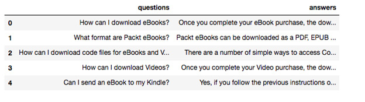


5.  To extract email addresses, we make use of a regular expression.
    Insert a new cell and add the following code to implement this:


    ```
    rr_tc = http.request('GET', 'https://www.packtpub.com/books/info/packt/terms-and-conditions')
    rr_tc.status
    soup2 = BeautifulSoup(rr_tc.data, 'html.parser')
    import re
    set(re.findall(r"[A-Za-z0-9._%+-]+@[A-Za-z0-9.-]+\.[A-Za-z]{2,4}",soup2.text))
    ```


    The preceding code generates the following output:

    
    


6.  To extract phone numbers using a regular expression, insert a new
    cell and add the following code:


    ```
    re.findall(r"\+\d{2}\s{1}\(0\)\s\d{3}\s\d{3}\s\d{3}",soup2.text)
    ```


    The preceding code generates the following output:


Activity 8: Dealing with Online JSON Files
------------------------------------------

**Solution**

1.  Open a Jupyter notebook.

2.  Import the necessary packages. Pass the given URL as an argument.
    Add the following code to implement this:


    ```
    import json
    import urllib3
    from textblob import TextBlob
    from pprint import pprint
    import pandas as pd
    http = urllib3.PoolManager()
    rr = http.request('GET', 'https://jsonplaceholder.typicode.com/comments')
    rr.status
    ```


    The preceding code generates the following output:

    
    


    Here, the HTTP code **200**, indicates that the request was
    successful.

3.  Load the `json` file and create a DataFrame from it. To
    implement this, insert a new cell and add the following code:


    ```
    data = json.loads(rr.data.decode('utf-8'))
    import pandas as pd
    df = pd.DataFrame(data).head(15)
    df.head()
    ```


    The preceding code generates the following output:

    
    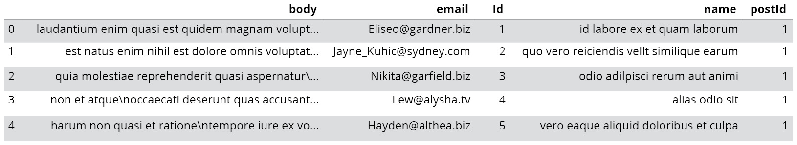


4.  Since we can use the language translation function of
    `TextBlob` a limited number of times, we will restrict
    this DataFrame to 15 rows. The following code snippet can be used to
    translate text to English:


    ```
    df['body_english'] = df['body'].apply(lambda x: str(TextBlob('u'+str(x)).translate(to='en')))
    df[['body', 'body_english']].head()
    ```


    The preceding code generates the following output:

    
    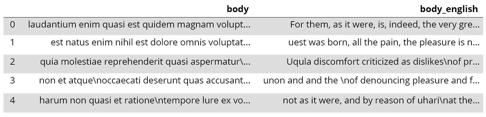


5.  Now, we will use `TextBlob` to find out the sentiment
    score of each of these comments:


    ```
    df['sentiment_score'] = df['body_english'].apply(lambda x: str(TextBlob('u'+str(x)).sentiment.polarity))
    df[['body_english', 'sentiment_score']]
    ```


    The preceding code generates the following output:


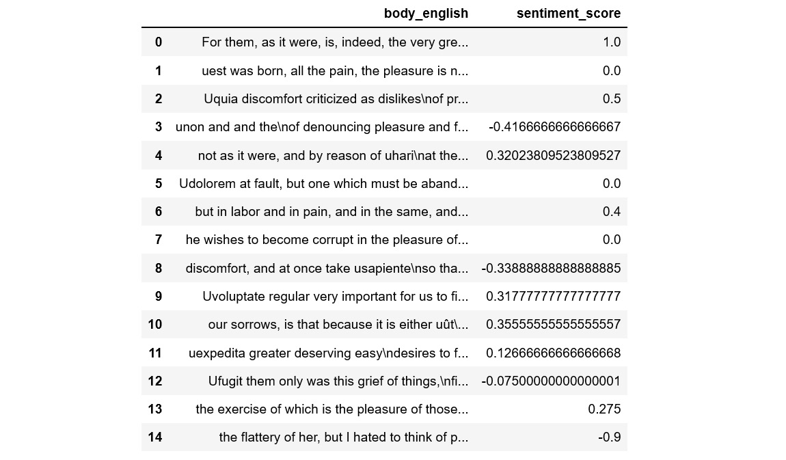


Activity 9: Extracting Data from Twitter
----------------------------------------

**Solution**

Let\'s extract tweets using the Tweepy library, calculate sentiment
scores, and visualize the tweets using a word cloud. Follow these steps
to implement this activity:

1.  Log in to your Twitter account with your credentials. Then, visit
    <https://dev.twitter.com/apps/new>, fill in the necessary details,
    and submit the form.

2.  Once the form is submitted, go to the **Keys** and **tokens** tab;
    copy `consumer_key`, `consumer_secret`,
    `access_token`, and `access_token_secret` from
    there.

3.  Open a Jupyter notebook.

4.  Import the relevant packages and follow the authentication steps by
    writing the following code:


    ```
    consumer_key = 'your consumer key here'
    consumer_secret = 'your consumer secret key here'
    access_token = 'your access token here'
    access_token_secret = 'your access token secret here'
    import pandas as pd
    import numpy as np
    import pickle
    import json
    from pprint import pprint
    from textblob import TextBlob
    from wordcloud import WordCloud, STOPWORDS
    import matplotlib.pyplot as plt
    import tweepy
    auth = tweepy.OAuthHandler(consumer_key, consumer_secret)
    auth.set_access_token(access_token, access_token_secret)
    api = tweepy.API(auth)
    ```


5.  Call the Twitter API with the `#WorldWaterDay` search
    query. Insert a new cell and add the following code to implement
    this:


    ```
    tweet_list = []
    cnt = 0
    for tweet in tweepy.Cursor(api.search, q='#WorldWaterDay', rpp=100).items():
        tweet_list.append(tweet)
        cnt = cnt + 1
        if cnt == 100:
            break
    tweet_list[0]
    ```


    The preceding code generates the following output:

    
    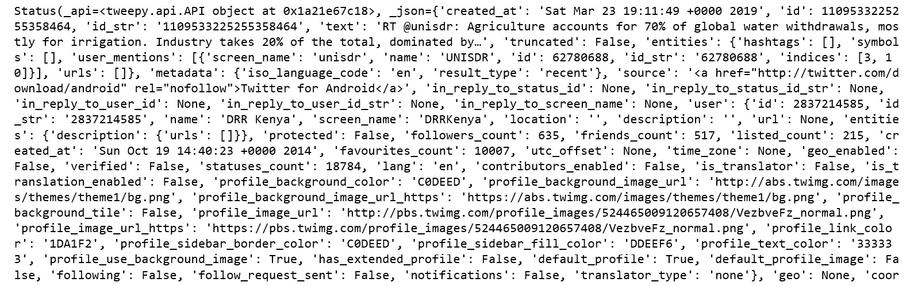


6.  Convert the Twitter `status` objects to `json`
    objects. Insert a new cell and add the following code to implement
    this:


    ```
    status = tweet_list[0]
    json_str = json.dumps(status._json)
    pprint(json.loads(json_str))
    ```


    The preceding code generates the following output:

    
    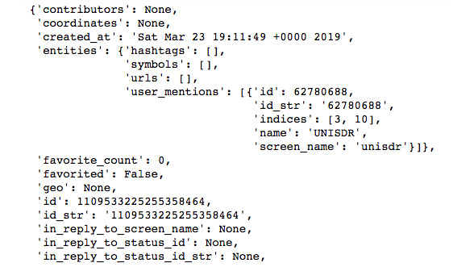


7.  To check the text of the fetched JSON file, add the following code:


    ```
    json.loads(json_str)['text']
    ```


    The preceding code generates the following output:

    
    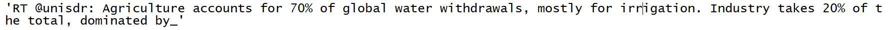


8.  Now we\'ll create a DataFrame consisting of the text of tweets. Add
    a new cell and write the following code to do this:


    ```
    tweet_text = []
    for i in range(0,len(tweet_list)):
        status = tweet_list[i]
        json_str = json.dumps(status._json)
        tweet_text.append(json.loads(json_str)['text'])
    unique_tweet_text = list(set(tweet_text))
    tweet_text_df = pd.DataFrame({'tweet_text' : unique_tweet_text})
    tweet_text_df.head()
    ```


    The preceding code generates the following output:

    
    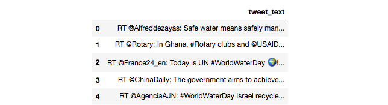


9.  To detect the language of all the tweets, we make use of the
    TextBlob library. Add the following code to do this:


    ```
    tweet_text_df['language_detected'] = tweet_text_df['tweet_text'].apply(lambda x : \
                                                                           str(TextBlob('u'+str(x)).detect_language()))
    tweet_text_df.head(20)
    ```


    The preceding code generates the following output:

    
    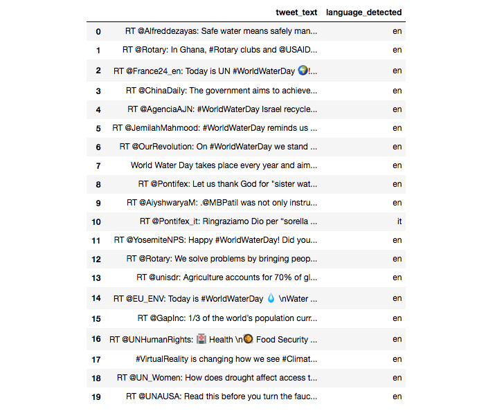


10. To have a look at the non-English tweets, we add the following code:


    ```
    tweet_text_df[tweet_text_df['language_detected']!='en']
    ```


    The preceding code generates the following output:

    
    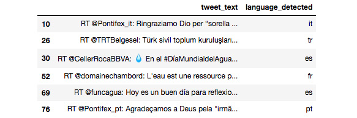


11. To check the shape of the DataFrame consisting of tweets in the
    English language, add the following code:


    ```
    tweet_text_df_eng = tweet_text_df[tweet_text_df['language_detected']=='en']
    tweet_text_df_eng.shape
    ```


    The preceding code generates the following output:

    
    


12. Now we\'ll extract the sentiment scores of the English tweets using
    the TextBlob library. Add the following code to do this:


    ```
    tweet_text_df_eng['sentiment_score'] = tweet_text_df_eng['tweet_text'].apply(lambda x: str(TextBlob('u'+str(x)).sentiment.polarity))
    pd.set_option('display.max_colwidth', -1)
    tweet_text_df_eng[['tweet_text', 'sentiment_score']].head(20)
    ```


    The preceding code generates the following output:

    
    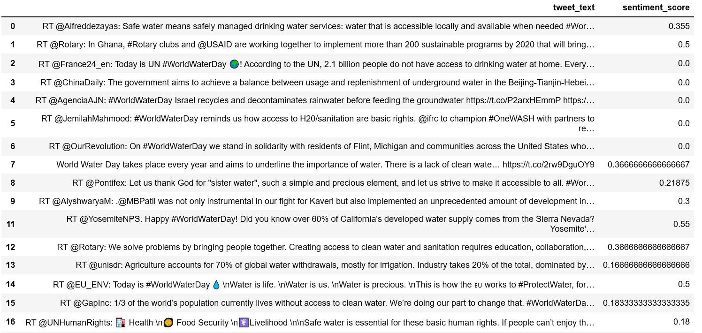


13. Once we have calculated the sentiment score of each tweet, we create
    a word cloud. Insert a new cell and add the following code to
    implement this:


    ```
    other_stopwords_to_remove = ['https', 'amp','co']
    STOPWORDS = STOPWORDS.union(set(other_stopwords_to_remove))
    stopwords = set(STOPWORDS)
    text=tweet_text_df_eng["tweet_text"]
    wordcloud = WordCloud(width = 800, height = 800, 
                    background_color ='white', 
                    max_words=100,
                    stopwords = stopwords, 
                    min_font_size = 10).generate(str(text))
    plt.imshow(wordcloud, interpolation='bilinear')
    plt.axis("off")
    plt.show()
    ```


    The preceding code generates the following output:


5. Topic Modeling
=================


Activity 10: Topic Modelling Jeopardy Questions
-----------------------------------------------

**Solution**

Let\'s perform topic modeling on the dataset of Jeopardy questions.
Follow these steps to implement this activity:

1.  Open a Jupyter notebook.
2.  Insert a new cell and add the following code to import the pandas
    library:


    ```
    import pandas as pd
    pd.set_option('display.max_colwidth', 800)
    ```

3.  To load the Jeopardy CSV file into a pandas DataFrame, insert a new
    cell and add the following code:


    ```
    JEOPARDY_CSV =  'data/jeopardy/Jeopardy.csv'
    questions = pd.read_csv(JEOPARDY_CSV)
    ```

4.  The data in the DataFrame is not clean. In order to clean it, we
    remove records that have missing values in the Question column. Add
    the following code to do this:


    ```
    questions = questions.dropna(subset=['Question'])
    ```

5.  Now import the gensim preprocessing utility and use it to preprocess
    the questions further. Add the following code to do this:


    ```
    from gensim.parsing.preprocessing import preprocess_string
    ques_documents = questions.Question.apply(preprocess_string).tolist()
    ```

6.  Now we\'ll create a gensim corpus and a dictionary, followed by an
    LdaModel instance from the corpus specifying the number of topics.
    Add the following code to do this:


    ```
    from gensim import corpora
    from gensim.models.ldamodel import LdaModel
    dictionary = corpora.Dictionary(ques_documents)
    corpus = [dictionary.doc2bow(text) for text in ques_documents]
    NUM_TOPICS = 8
    ldamodel = LdaModel(corpus, num_topics = NUM_TOPICS, id2word=dictionary, passes=15)
    ```

7.  Now we\'ll print the resulting topics. Add the following code to do
    this:


    ```
    ldamodel.print_topics(num_words=6)
    ```
    

6. Text Summarization and Text Generation
=========================================


Activity 11: Summarizing a Downloaded Page Using the Gensim Text Summarizer
---------------------------------------------------------------------------

**Solution**

Let\'s summarize a downloaded page with the help of the Gensim text
summarizer. Follow these steps to implement this activity:

1.  Open a Jupyter notebook.

2.  Insert a new cell and add the following code to import the necessary
    libraries:


    ```
    import warnings
    warnings.filterwarnings('ignore')
    from gensim.summarization import summarize
    import requests
    ```


3.  The following code uses the `requests` library to get the
    Why Click page. After getting the page, we change the encoding to
    `utf-8` in order to properly decode some of the content on
    the page. Then, we use `BeautifulSoup` to find the text
    content of the div with the ID `#why-click`. This div
    contains the main text of the `why-click` page:


    ```
    from bs4 import BeautifulSoup 
    r = requests.get('https://click.palletsprojects.com/en/7.x/why/')
    r.encoding = 'utf-8'
    soup = BeautifulSoup(r.text)
    why_click = soup.find(id="why-click").text.replace('\n', ' ')
    ```


4.  Here, we create a utility function to display the sentences in a
    given piece of text. Note that we could simply output the text to
    the notebook or use `print()`. But using the
    `show_sentences()` function allows us to see the
    individual sentences in the summary. The function uses
    `pandas` DataFrames so that it displays nicely in the
    Jupyter notebook:


    ```
    import pandas as pd
    pd.set_option('display.max_colwidth',500)
    def show_sentences(text):
        return pd.DataFrame({'Sentence': sent_tokenize(text)})
    ```


5.  We have defined a function that turns text into a DataFrame
    containing the sentences in the text. This gives us the option to
    see the text as it is or see its sentences. Let\'s look at the
    article first. Add the following code:


    ```
    why_click
    ```


    The code generates the following output:

    
    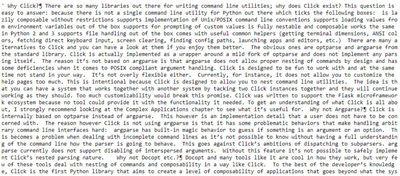


    Note that we have lost the formatting of the original article since
    we extracted the text from HTML.

6.  In this code cell, we use the `show_sentences()` function
    to show the sentences in the original article. There are
    `57` sentences in the article, as shown in the following
    figure:


    ```
    show_sentences(why_click)
    ```


    The code generates the following output:

    
    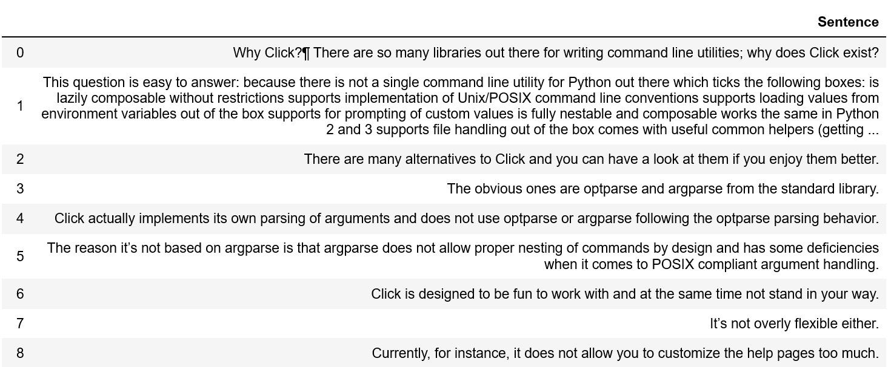


7.  Now we create a `summary` using the
    `summarize()` function, and then look at the sentences.
    Note that we use the defaults for `summarize`:


    ```
    summary = summarize(why_click)
    summary
    ```


    The code generates the following output:

    
    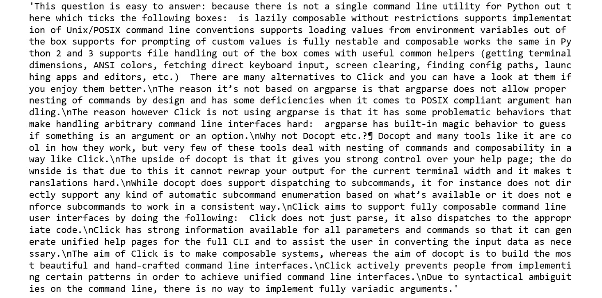


8.  The `summarize()` function can also break the text into
    sentences if we pass the optional `split` parameter. The
    following will print a list of sentences:


    ```
    summary = summarize(why_click, split=True)
    summary
    ```


    The code generates the following output:

    
    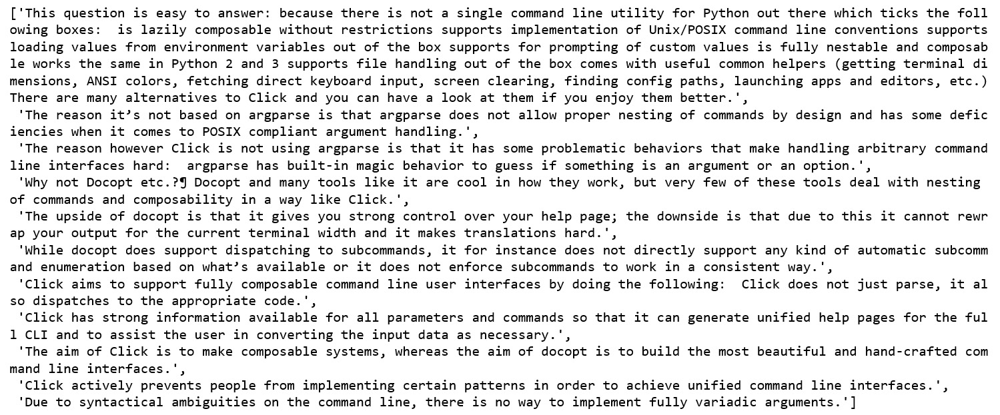


9.  The `summarize()` function has a parameter called
    `ratio`, which you use to specify the proportion of the
    original text to return in the summary. Here, we use
    `ratio=0.1` to return 10% of the original article:


    ```
    summary = summarize(why_click, ratio=0.1)
    show_sentences(summary)
    ```


    The code generates the following output:

    
    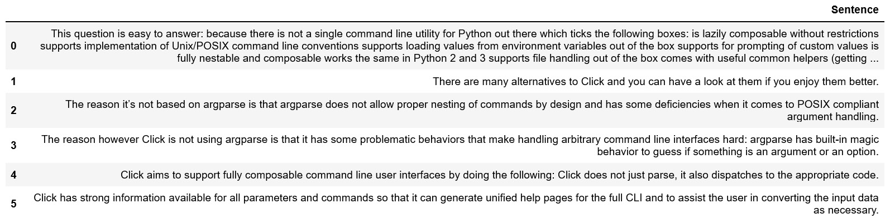


10. You can also pass the `word_count` parameter to limit the
    number of words returned:


    ```
    summary = summarize(why_click, word_count=200)
    summary
    ```


    The code generates the following output:


7. Vector Representation
========================


Activity 12: Finding Similar Movie Lines Using Document Vectors
---------------------------------------------------------------

**Solution**
---------------------------------

Let\'s build a movie search engine that finds similar movie lines to the
one provided by the user. Follow these steps to complete this activity:

1.  Open a Jupyter notebook.

2.  Insert a new cell and add the following code to import all necessary
    libraries:


    ```
    import warnings
    warnings.filterwarnings("ignore")
    from gensim.models import Doc2Vec
    import pandas as pd
    from gensim.parsing.preprocessing import preprocess_string, remove_stopwords 
    ```


3.  Now we load the `movie_lines1` file. After that, we need
    to iterate over each movie line in the file and split the columns.
    Also, we need to create a DataFrame containing the movie lines.
    Insert a new cell and add the following code to implement this:


    ```
    movie_lines_file = '../data/cornell-movie-dialogs/movie_lines1.txt'
    with open(movie_lines_file) as f:
        movie_lines = [line.strip().split('+++$+++') 
                       for line in f.readlines()];
    lines_df = pd.DataFrame([{'LineNumber': d[0].strip(), 
                                    'Person': d[3].strip(),
                                    'Line': d[4].strip(),
                                     'Movie' : d[2].strip()} 
                                  for d in movie_lines])
    lines_df = lines_df.set_index('LineNumber')
    ```


4.  We have a trained document model named
    `MovieLinesModel.d2v`. Now we can simply load and use it.
    Insert a new cell and add the following code to implement this:


    ```
    docVecModel = Doc2Vec.load('../data/MovieLinesModel.d2v')
    ```


5.  Now, since we have loaded the document model, we create two
    functions, namely `to_vector()` and
    `similar_movie_lines()`. The `to_vector()`
    function converts the sentences into vectors. The second function,
    `similar_movie_lines()`, implements the similarity check.
    It uses the `docVecModel.docvecs.most_similar()` function,
    which compares the vector against all the other lines it was built
    with. To implement this, insert a new cell and add the following
    code:


    ```
    from gensim.parsing.preprocessing import preprocess_string, remove_stopwords
    def to_vector(sentence):
        cleaned = preprocess_string(sentence)
        docVector = docVecModel.infer_vector(cleaned)
        return docVector
    def similar_movie_lines(sentence):
        vector = to_vector(sentence)
        similar_vectors = docVecModel.docvecs.most_similar(positive=[vector])
        similar_lines = [lines_df.ix[line[0]].Line for line in similar_vectors]
        return similar_lines
    ```


6.  Now that we have created our functions, it is time to test them.
    Insert a new cell and add the following code to implement this:


    ```
    similar_movie_lines("Sure, that's easy.  You gotta insult somebody.")
    ```


    We have learned how to find similar movie lines with the help of
    document vectors.


8. Sentiment Analysis
=====================


Activity 13: Tweet Sentiment Analysis Using the TextBlob library
----------------------------------------------------------------

**Solution**

Let\'s perform sentiment analysis on tweets related to airlines. Follow
these steps to implement this activity:

1.  Open a Jupyter notebook.

2.  Insert a new cell and add the following code to import the necessary
    libraries:


    ```
    import pandas as pd
    from textblob import TextBlob
    import re
    ```


3.  Since we are displaying the text in the notebook, we want to
    increase the display width for our DataFrame.
    Insert a new cell and add the following code to implement this:


    ```
    pd.set_option('display.max_colwidth', 240)
    ```


4.  Now we load the `Tweets.csv` dataset. From this dataset,
    we are only fetching the \"`text`\" column. Thus, we need
    to mention the \"`text`\" column name as the value for the
    `usecols` parameter of the `read_csv()`
    function. The fetched column is later being replaced to a new column
    named \"`Tweet`\". Insert a new cell and add the following
    code to implement this:


    ```
    TWEET_DATA_FILE = '../data/twitter-airline-sentiment/Tweets.csv'
    tweets = pd.read_csv(TWEET_DATA_FILE, usecols=['text'])
    tweets.columns = ['Tweet']
    ```


    ### Note

    The Tweets.csv dataset is located at this link:
    <https://bit.ly/2NwRwP9>.

5.  Insert a new cell and add the following code to view the first
    `10` records of the DataFrame:


    ```
    tweets.head(10)
    ```


    The code generates the following output:

    
    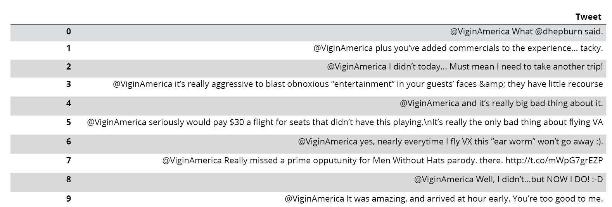


6.  If we look at the preceding figure, we can see that the tweets
    contain Twitter handles, which start with the `@` symbol.
    It might be useful to extract those handles. The `string`
    column included in the DataFrame has an `extract()`
    function, which uses a regex to get parts of a string. Insert a new
    cell and add the following code to implement this:


    ```
    tweets['At'] = tweets.Tweet.str.extract(r'^(@\S+)')
    ```


    This code declares a new column called `At` and sets the
    value to what the `extract` function returns. The
    `extract` function uses a regex, `^(@\S+)`, to
    return strings that start with `@`. To view the initial 10
    records of the \"`tweets`\" DataFrame, we insert a new
    cell and write the following code:


    ```
    tweets.head(10)
    ```


The expected output for first ten tweets should be as follows:


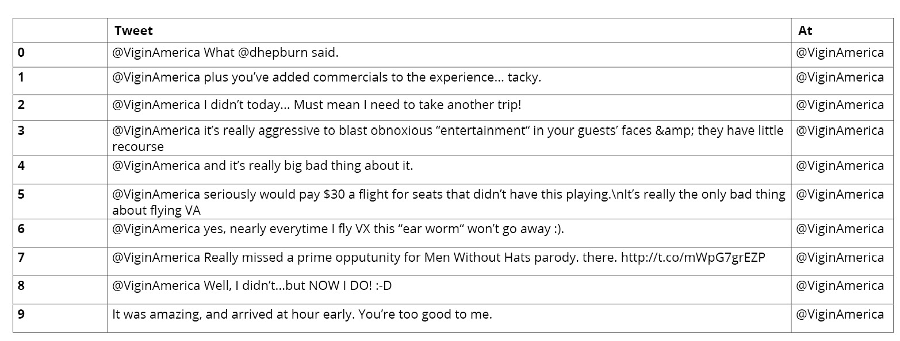


1.  Now, we want to remove the Twitter handles since they are irrelevant
    for sentiment analysis. First, we create a function named
    `remove_handles()`, which accepts a DataFrame as a
    parameter. After passing the DataFrame, the `re.sub()`
    function will remove the handles in the DataFrame. Insert a new cell
    and add the following code to implement this:


    ```
    def remove_handles(tweet):
        return re.sub(r'@\S+', '', tweet)
    ```


2.  To remove the handles, insert a new cell and add the following code:


    ```
    tweets.text = tweets.text.apply(remove_handles)
    tweets.head(10)
    ```


    The expected output for first ten tweets after removing the Twitter
    handles should be as follows:

    
    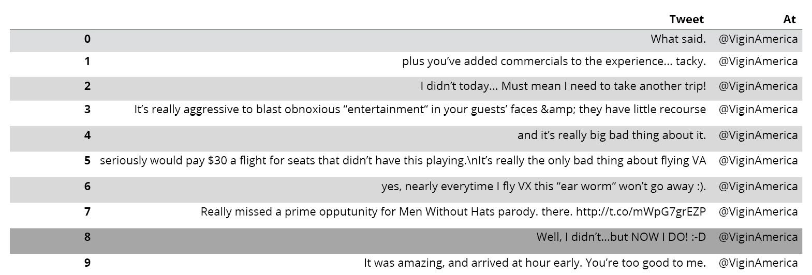


    From the preceding figure, we can see that the Twitter handles have
    been separated from the tweets.

3.  Now we can apply sentiment analysis on the tweets. First we need to
    create a `get_sentiment()` function, which accepts a
    DataFrame and a column as parameters. Using this function, we create
    two new columns, `Polarity` and `Subjectivity`,
    which will show the sentiment scores of each tweet. Insert a new
    cell and add the following code to implement this:


    ```
    def get_sentiment(dataframe, column):
        text_column = dataframe[column]
        textblob_sentiment = text_column.apply(TextBlob)
        sentiment_values = [ {'Polarity': v.sentiment.polarity, 
                              'Subjectivity': v.sentiment.subjectivity}
                       for v in textblob_sentiment.values]
        return pd.DataFrame(sentiment_values)
    ```


    This function takes a DataFrame and applies the `TextBlob`
    constructor to each value of `text_column`. Then it
    extracts and creates a new DataFrame with the columns for
    `Polarity` and `Objectivity`.

4.  Since the function has been created, we test it, passing the
    necessary parameters. The result of this will be stored in new
    DataFrame, `sentiment_frame`. Insert a new cell and add
    the following code to implement this:


    ```
    sentiment_frame = get_sentiment(tweets, 'text')
    ```


    To view the initial four values of the new DataFrame, type the
    following code:


    ```
    sentence_frame.head(4)
    ```


    The code generates the following output:

    
    


5.  To join the original `tweet` DataFrame to the
    `sentiment_frame` DataFrame, we make use of the
    `concat()` function. Insert a new cell and add the
    following code to implement this:


    ```
    tweets = pd.concat([tweets, sentiment_frame], axis=1)
    ```


    To view the initial 10 rows of the new DataFrame, we add the
    following code:


    ```
    tweets.head(10)
    ```


    The expected output with sentiment scores added should be as
    follows:

    
    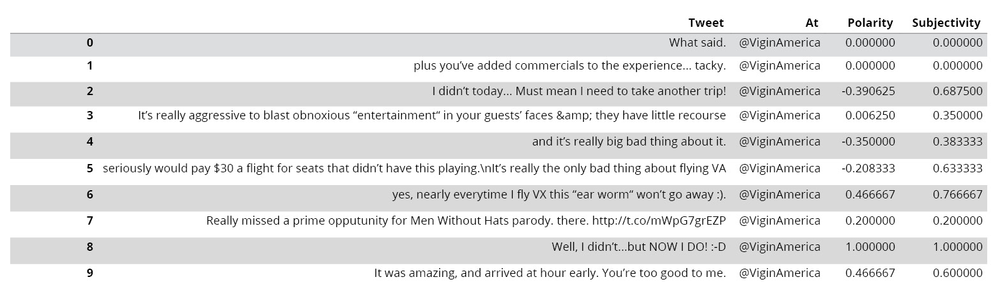


    From the preceding figure, we can see that for each **tweet**,
    **polarity**, and **subjectivity** scores have been calculated.

6.  To distinguish between the positive, negative, and neutral tweets,
    we need to add certain conditions. We will consider tweets with
    polarity scores greater than `0.5` as positive, and tweets
    with polarity scores less than or equal to `-0.5` as
    negative. For neutral, we will consider only those tweets that fall
    in the range of `-0.1` and `0.1`. Insert a new
    cell and add the following code to implement this:


    ```
    positive_tweets = tweets[tweets.Polarity > 0.5]
    negative_tweets = tweets[tweets.Polarity <= - 0.5]
    neutral_tweets = tweets[ (tweets.Polarity > -0.1) & (tweets.Polarity < 0.1) ]
    ```


    To view positive, negative, and neutral tweets, we add the following
    code:


    ```
    positive_tweets.head(15)
    negative_tweets.head(15)
    neutral_tweets
    ```


    This displays the result of positive, negative, and neutral tweets.
